Working with GMNS Files in QGIS and NeXTA

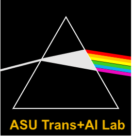

Version 0.5, 11/01/2020

Prepared by Dr. Xuesong (Simon) Zhou’ research group at Arizona State University

Contact: xzhou74\@asu.edu

Table of Contents

[Part I: Basic Understanding of GMNS and visualization	2](#_Toc55123622)

>   [1. Introduction of GMNS, AMS, QGIS and NeXTA	2](#_Toc55123623)

>   [2. Import GMNS file with geometry field in QGIS	3](#_Toc55123624)

>   [3. Load XYZ Tiles in QGIS with background maps	4](#_Toc55123625)

>   [4. Visualize output file link_performance.csv in QGIS	5](#_Toc55123626)

>   [5. View/edit GMNS network in NeXTA	8](#_Toc55123627)

>   [6. Load GMNS network with background image in NeXTA through the help of
>   QGIS	14](#_Toc55123628)

[Part II: Advanced Topics: Create GMNS Networks	18](#_Toc55123629)

>   [7. Create GMNS Network in NeXTA	18](#_Toc55123630)

>   [8. Create a Network in NeXTA from the background map
>   image	25](#_Toc55123631)

>   [9. Create network through QuickOSM QGIS Plugin	35](#_Toc55123632)

>   [10. Create GMNS network from Openstreet Maps (OSM) file	40](#_Toc55123633)

>   [11. Create multi-resolution GMNS network through open-source
>   Ocean	40](#_Toc55123634)

Data set

<https://github.com/xzhou99/traffic-engineering-and-analysis/tree/master/undergraduate_student_project/data_sets_GMNS0.9/07_West_Jordan_Utah>

Software:

QGIS, NeXTA

Audiences:

GIS users, city planners and transportation planners

Learning Objectives:

1.  Understand how to view/edit network attributes in NeXTA

2.  Understand the user interface of NEXTA

3.  Understand node and link files in GMNS format

4.  Use QGIS to visualize GMNS network

# Part I: Basic Understanding of GMNS and visualization 

## 1. Introduction of GMNS, AMS, QGIS and NeXTA

What is GMNS?

General Travel Network Format Specification is a product of Zephyr Foundation,
which aims to advance the field through flexible and efficient support,
education, guidance, encouragement, and incubation.

Further Details in
<https://zephyrtransport.org/projects/2-network-standard-and-tools/>

What is AMS?

As stated in FHWA website,
<https://cms7.fhwa.dot.gov/research/operations/analysis-modeling-simulation/analysis-modeling-simulation-overview>,
FHWA and its State and local agency partners have relied on analysis, modeling,
and simulation (AMS) to support investment decisions for the transportation
system. As the transportation system environment grows in complexity, increasing
pressure is placed on agencies to identify more innovative and efficient
solutions to a wide range of issues. These solutions include leveraging emerging
technologies, data sources, and alternative (non-traditional) strategies. AMS
tools will continue to play a critical role in evaluating these solutions.

What is QGIS?

QGIS is a free and open-source cross-platform desktop geographic information
system (GIS) application that supports viewing, editing, and analysis of
geospatial data.

QGIS functions as geographic information system (GIS) software, allowing users
to analyze and edit spatial information, in addition to composing and exporting
graphical maps.

QGIS supports both [raster](https://en.wikipedia.org/wiki/Raster_graphics) and
[vector](https://en.wikipedia.org/wiki/Vector_graphics) layers; vector data is
stored as either point, line, or
[polygon](https://en.wikipedia.org/wiki/Polygon_(computer_graphics)) features.
Multiple formats of raster images are supported, and the software can
georeference images.

**Source:** <https://en.wikipedia.org/wiki/QGIS>

What is NEXTA?

NeXTA: Network explorer for Traffic Analysis

In general, the software suite of NeXTA aims to:

(1) Provide an open-source code base to enable transportation researchers and
software developers to expand its range of capabilities to various traffic
management application.

(2) Present results to other users by visualizing **time-varying traffic flow
dynamics** and traveler route choice behavior in an integrated environment.

(3) Provide a free, educational tool for students to understand the complex
decision-making process in **transportation planning and optimization**
processes

(4) By managing GMNS data sets in both QGIS and NeXTA platforms, users can
visualize the background GIS map for a GMNS network, in a broader spatial
context, while NeXTA can provide time-dependent link performance visualization,
path-level and agent-level analysis, and time-dependent agent trajectory
visualization.

The full user guide of NeXTA can be found at
https://github.com/xzhou99/NeXTA-GMNS.

This document describes the process of obtaining [node.csv, link.csv, etc]
GMNS-compatible files for use in QGIS from an OSM network and how to display
GMNS file including node.csv, link.csv, timing.csv, agent.csv and
link_performance.csv in QGIS.

## 2. Import GMNS file with geometry field in QGIS

Open GMNS node.csv and link.csv in Excel to verify the existence of the geometry
field.

You now have the completed QGIS-compatible file by steps 1 and 2. Open QGIS and
click on menu LayerAdd LayerAdd Delimited Text Layer. In the following dialogue
box, load GMNS node.csv and link.csv, and ensure WKT is selected as geometry
definition.

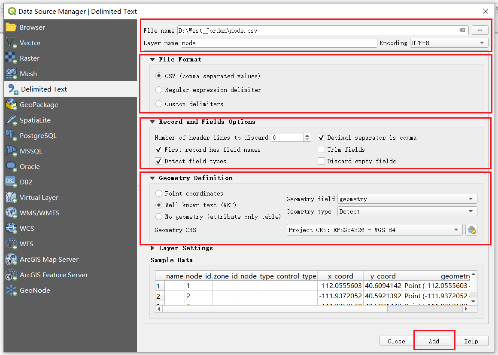

The imported West Jordon network is shown as follows.

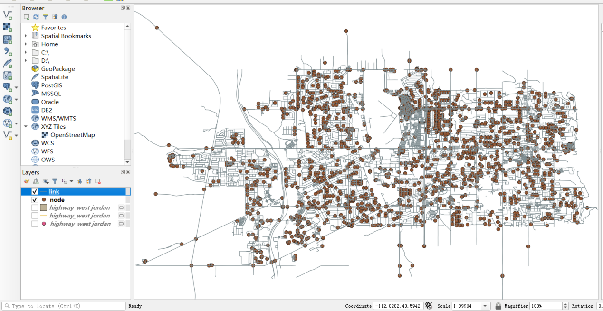

## 3. Load XYZ Tiles in QGIS with background maps

Find XYZ Tiles and double-click OpenStreetMap on Browser panel. Please move the
background layer to the bottom to show the GMNS network.

Refence:
<https://gis.stackexchange.com/questions/20191/adding-basemaps-from-google-or-bing-in-qgis>

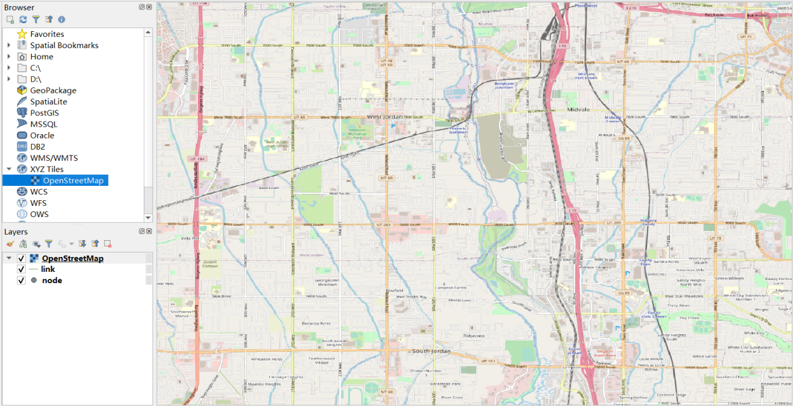

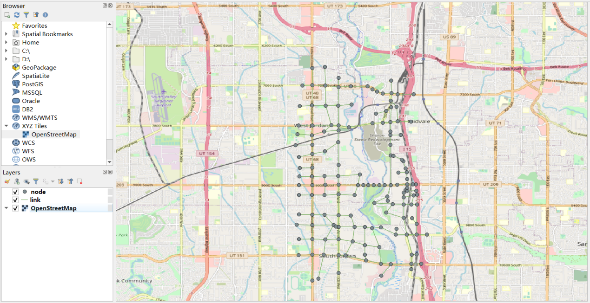

## 4. Visualize output file link_performance.csv in QGIS 

The 'geometry' field can be obtained from link.csv file. Then open this file in
the same way as above. (LayerAdd LayerAdd Delimited Text Layer)

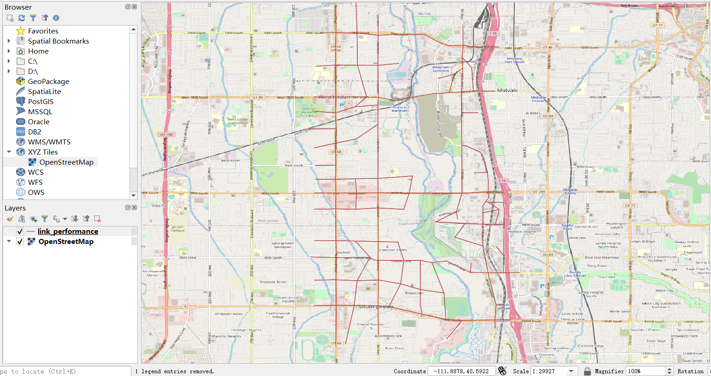

Then you can show the width of links by field VOC with different color according
level of VOC in link_performance layer. Right click on link_performance layer
and click on propertiescontrol feature symbology

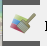

. Select GraduatedValue: VOCMethodSizeClasses: 6Classify and set the value of
the VOC level.

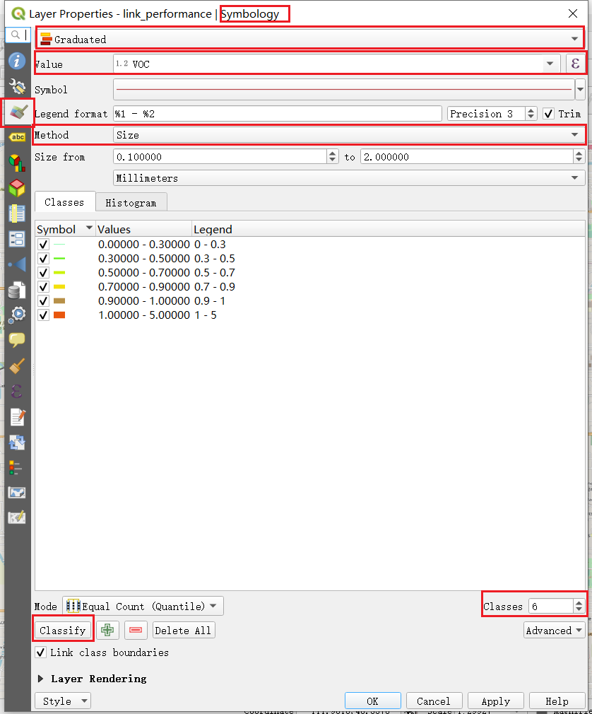

Note that, you can set color and width according to VOC field of each level.

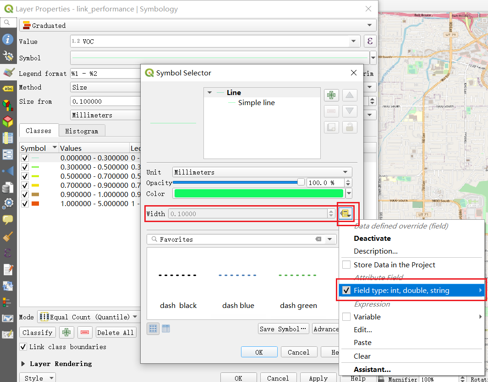

Then you can display traffic assignment result with following picture.

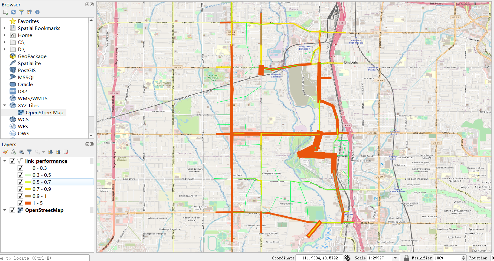

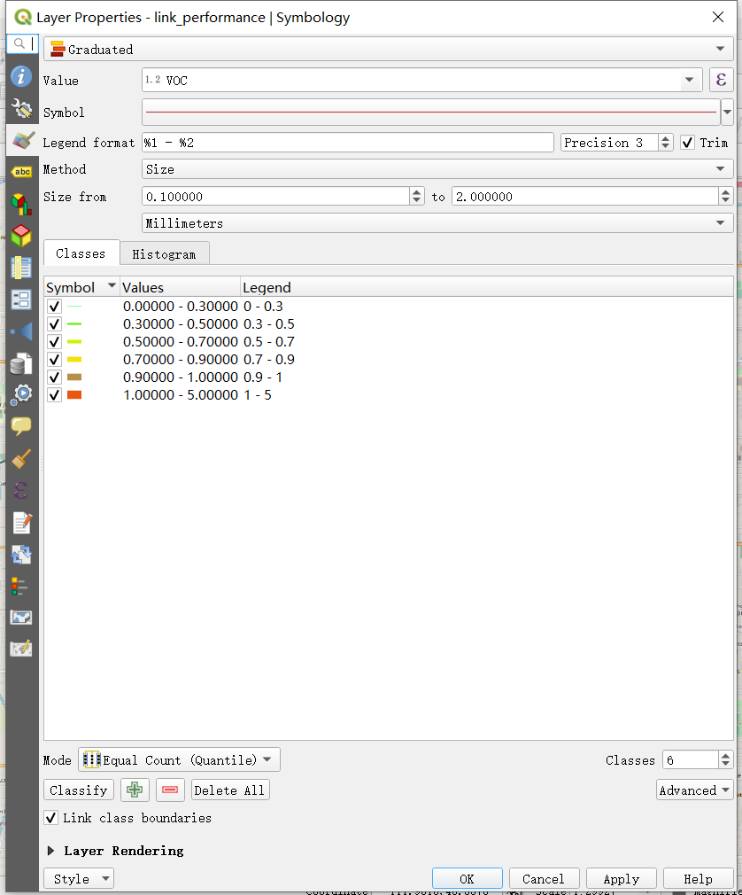

## 5. View/edit GMNS network in NeXTA 

Step 1: Download and Open NeXTA, Open the Tempe ASU Network

Before going into too much detail, first makes sure you’re using the most
up-to-date version of NeXTA, and open the Tempe ASU network.

Step 2: Open the Tempe ASU Network in NeXTA

In NeXTA, go to File -\> Open Traffic Network Project

In the Lesson 1, go to the Tempe_ASU_network folder, select the **node.csv**
file, and click **Open**

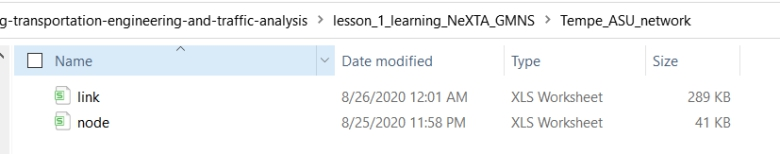

NeXTA will open the network, and display the **File Loading Status window**. The
File Loading Status window displays information about the network currently open
in NeXTA, including information about the number of links, nodes, and
zones/activity locations in the network. This window can also be accessed by
going to **File -\> Check Data Loading Status**.

Step 3: Viewing/Editing Network Attributes in NeXTA

Network objects primarily consist of links, nodes, and zones. A driver starts
and ends their trip at a zone, traveling along road segments (links) between the
origin and destination. Links are connected together at nodes, where a node may
represent an intersection or a simple connection between two road segments.

Since vehicles only travel along links, passing nodes between their origin and
destination, trip details (such as travel time, distance, speed, etc.) are
heavily dependent upon link and node attributes. The most important link
attributes are typically link length, speed limit, number of lanes, and
capacity. Since nodes typically represent intersections, their important
attributes typically include node control type (signalized intersection,
stop-controlled intersection, no control, etc.) and traffic signal-related
attributes.

This section will quickly explain how to view and edit these network object
attributes.

**Step 3.1:** To quickly view most link or node attributes, simply select a link
or node using the Select Object tool, and look at the attributes in the GIS
Layer Panel in the bottom right corner of the screen.

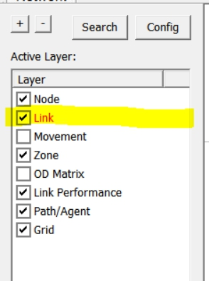

**Step 3.2:** Select link layer as highlighted above.

**Step 3.3:** Select a link along Rural Road as shown below,

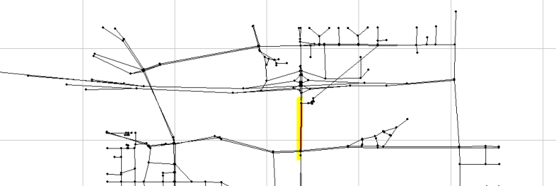

Check the Link Attribute display on the left hand size as shown below.

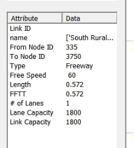

One can now select the node layer in the GIS Layer Panel,

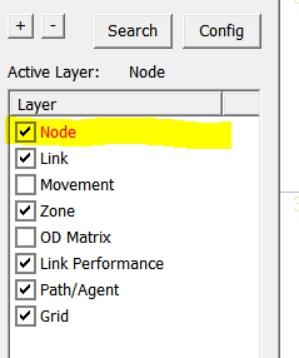

**Step 3.4:** Select a node close to ASU campus,

Check the Node Attribute display on the left-hand size as shown below.

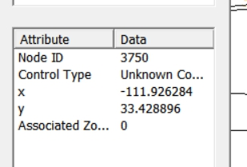

Alternatively, after selecting the link or node, **right-click** near the object
and select either Edit Link Properties or Node Properties. Selecting Edit Link
Properties opens the Link Properties dialog box, shown below. These dialog boxes
offer the ability to edit individual link and node attributes quickly and easily
- simply replace the text/values in the appropriate field, select OK, and click
the Save button

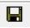

on the Tool Bar to save your changes to the network.

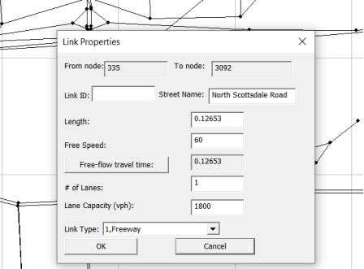

Step 4: Find short paths and use path analysis tool in NeXTA

The Path Analysis Tool is enabled by using the

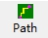

button or going to MOE \> Path List Dialog, which is used to view link
attributes and path travel time statistics.

To use the tool, a path must first be selecting in the path layer as shown
below.

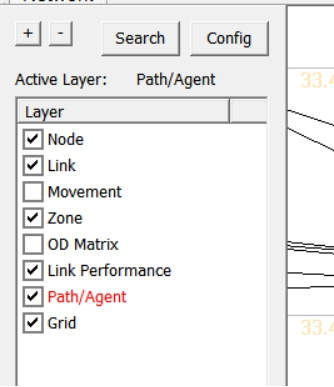

As a recap, this is accomplished by right-clicking the mouse at the origin node
for the path, selecting “Direction from Here”, and then right-clicking again at
the destination, selecting “Direction to Here”. The path is chosen automatically
based on the shortest path between the two points.

Selecting the

button opens the Path Information window, as shown in the example below. Similar
to the Link Information window, this tool shows link attributes for the links in
the path.

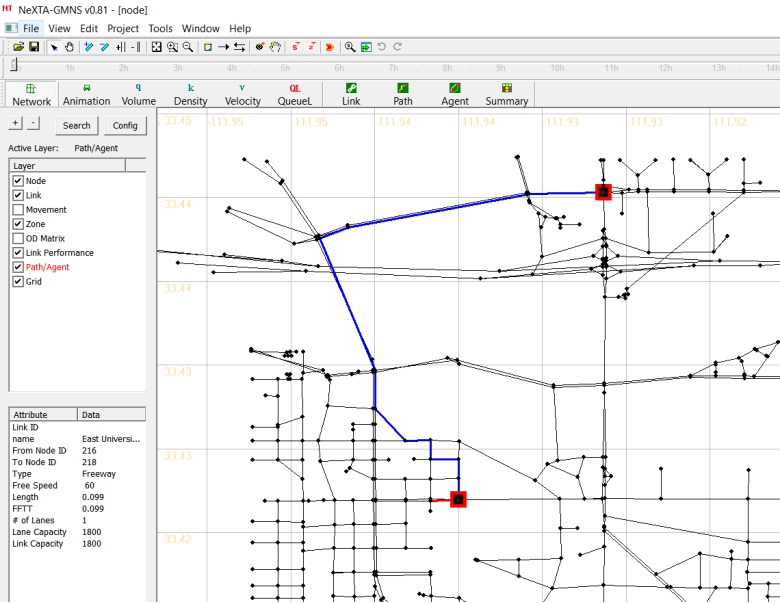

## 6. Load GMNS network with background image in NeXTA through the help of QGIS

Open base map in QGIS

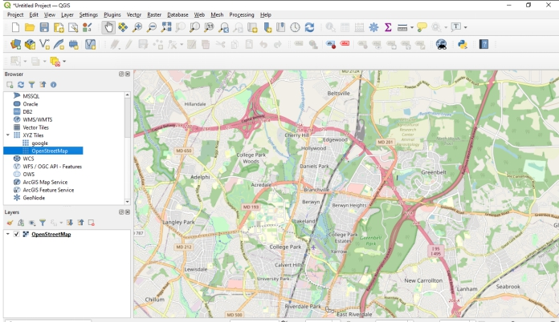

Load GMNS network CSV file in QGIS

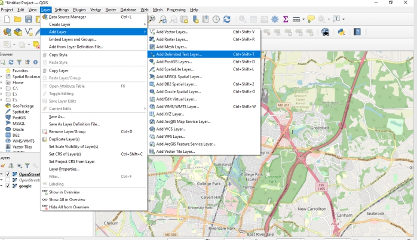

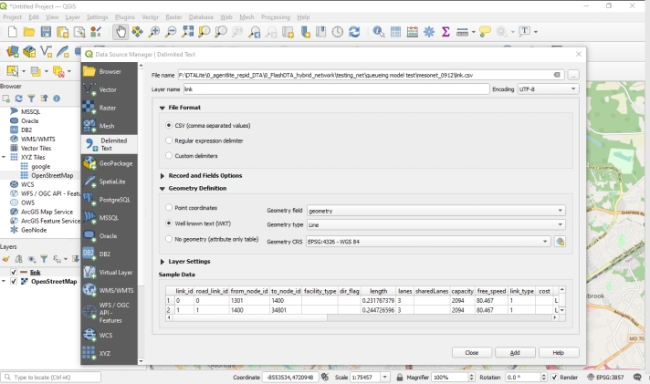

Arrange the order of QGIS layers so that the background images are shown below
the network layer.

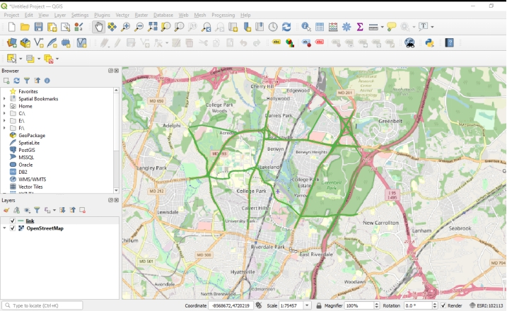

Choose the proper area and export the map as image by clicking on menu
Project-\>Import/Export/Export Map to Image

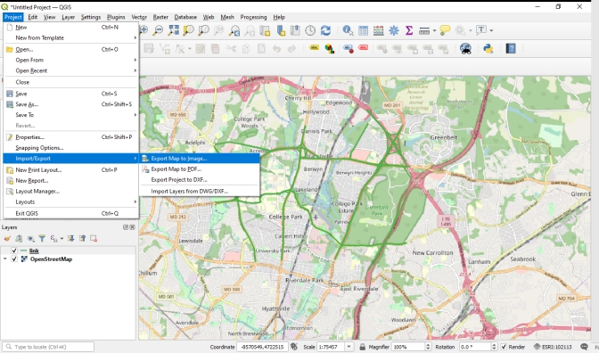

Choose the proper network resolution, size of image, and please also select lock
the aspect ratio.

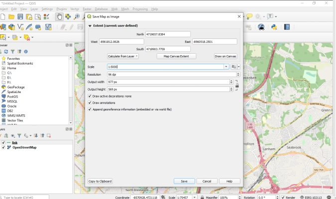

Save it as .bmp format image and the same folder of the STALite/NeXTA project.

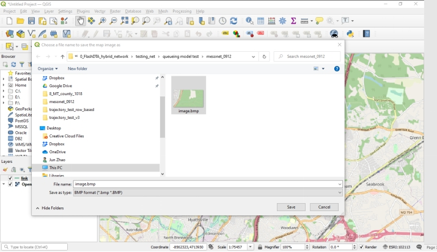

Open node.csv and the related GMNS folder within NeXTA directly, with background
map.

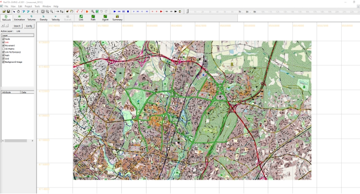

# Part II: Advanced Topics: Create GMNS Networks 

## 7. Create a GMNS Network in NeXTA without background image

Learning objectives:

1. How to create a network by yourself.

2. How to adjust network elements size.

3. How to edit and view the attributes of Network.

4. How to create a network from the background map image.

5. How to verify the network connectivity.

Step 1: Open NeXTA

open NeXTA.exe

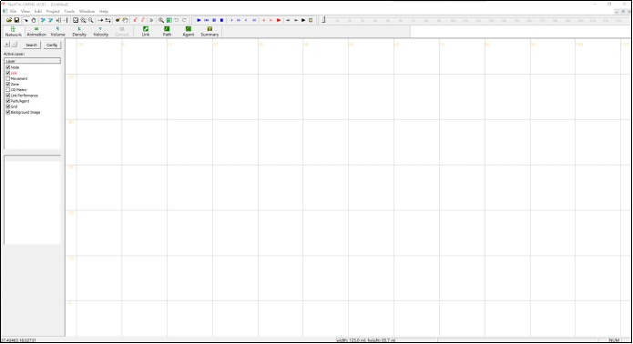

Step 2: Add new one-way links

Related toolbar buttons:

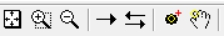

Step 2.1: Press the “Link”

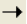

toggle button.

Step 2.2: Press the left mouse on the location you want the link to start. This
could be on an existing node or where no node currently exists. Move the cursor
to the desired end of the link. Now release the left mouse on the location you
want the link to end. Again, this can be on a node or not. A link will be
created between these two locations, as shown below:

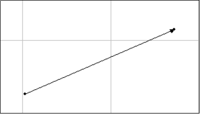

Step 3: Add multiple connected links

Related toolbar buttons:

,

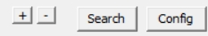

Step 3.1: Press the “Link”

toggle button.

Step 3.2: Add an one-way link according to Step2.

Step 3.3: Press the left mouse on the location you want the link to start. A set
of links will be created between these two locations as, as shown below:

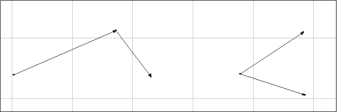

Step 3.4: Press the

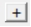

toggle button and adjust node size. It is obvious that the link (1,2) is
connected with link(2,3), as shown below:

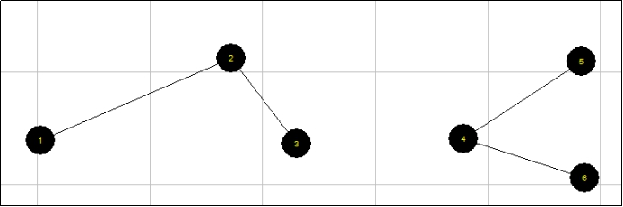

Step 4: Create a Network

Step 4.1: Repeat Step3.1-Step3.3 and create a network, as shown below:

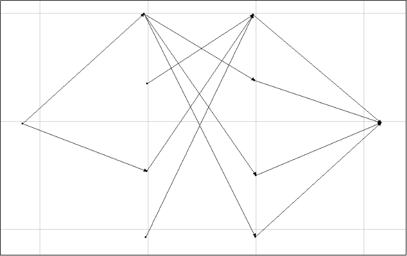

Step 5: Adjust node size for display

Related toolbar buttons:

Step 5.1: Press the

toggle button and adjust node size, as shown below:

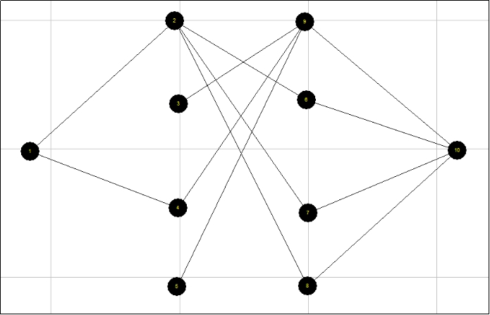

Step 6: Edit and view the attribute of a link

Related toolbar buttons:

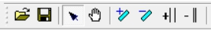

Step 6.1: Click the “select”

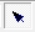

toggle button.

Step 6.2: Click the “link” layer in the “Active layer panel”, the corresponding
layer is then highlighted in red, as shown below:

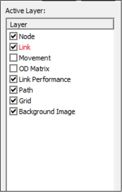

Step 6.3: Click on the link to select it.

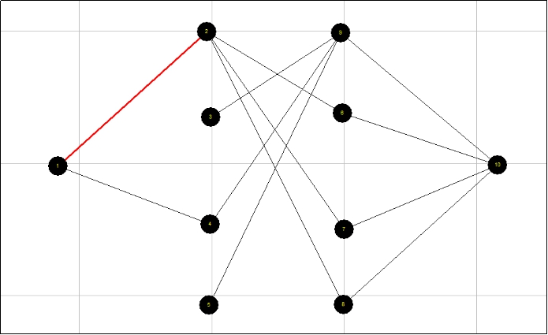

Step 6.4: Click the right mouse on the position of a selected link and you can
select to view or edit the attributes of the selected link, as shown below:

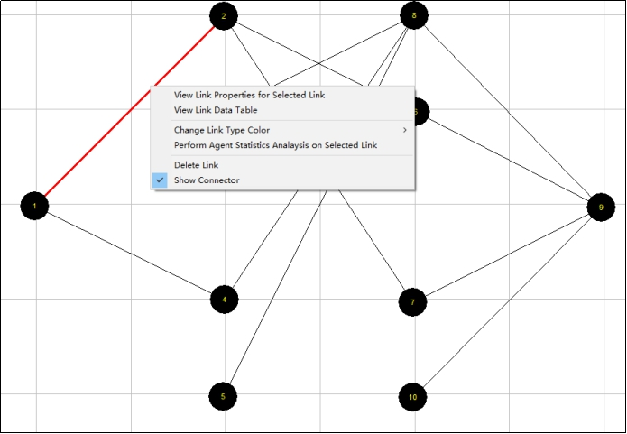

Step 7: Edit and view the attributes of a node

Related toolbar buttons:

Step 6.1: Click the “select”

toggle button.

Step 6.2: Click the “node” layer in the “Active layer panel”, as shown below:

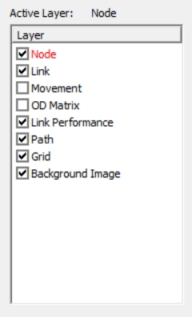

Step 6.3: Click on the node and then it will be selected, as shown below:

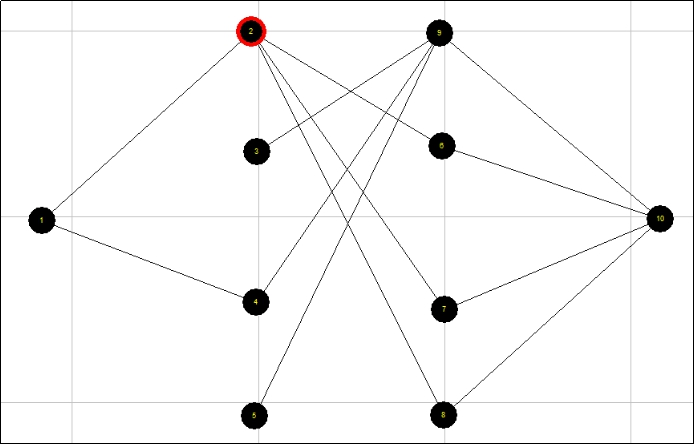

Step 6.4: Click the right mouse on the position of selected node and you can
select to view or edit the attributes of the selected node, as shown below:

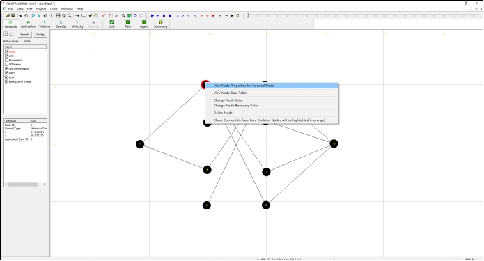

Step 8: Save GMNS data of node and link csv files

Related toolbar buttons:

Step 8.1: Click the “save”

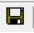

toggle button and to save the files of “node.csv” and “link.csv” to the local
project folder.

## 8. Create a Network in NeXTA from the background map image

Step 1: Create a new project folder with 3 files: image.bmp, and node.csv

Step 1.1: First, prepare a map image in the BMP format and rename it as
“image.bmp”.

Step 1.2: Prepare an “image.ini” file in Notepad with the following value for
the real world width (the unit could be mile or km).

Step 1.3: Create a csv file and rename it as “node.csv”. This can be empty.

Step 1.4: Put all the files and NeXTA.exe in the new project folder, as shown
below:

Step 2: Run NeXTA to load node.csv

Step 2.1: First, double click and run NeXTA.exe, resulting in the following
screen.

Step 3: Verify if the background image is automatically loaded.

Step 3.1: Click the “link” layer in the “Active layer panel”, as shown below:

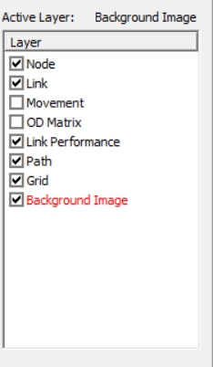

Step 3.2: Click “file menu” and select “Open Traffic Network Project”. Then,
open the “node.csv” in the new window, as shown below:

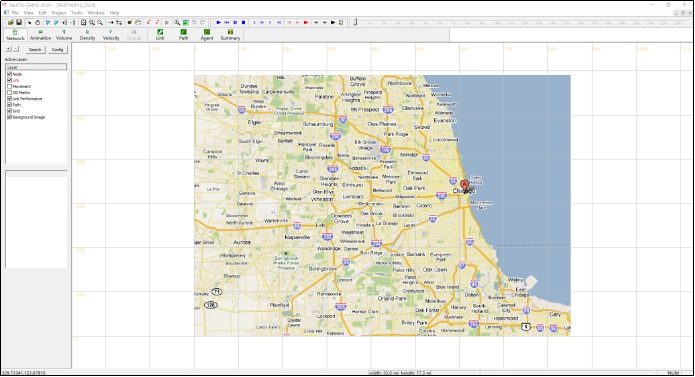

Step 4: Add a sequence of new two-way links based on background image

Step 5: Create a Traffic Network

Step 5.1: Repeat Step 4 and create a traffic network, as shown below:

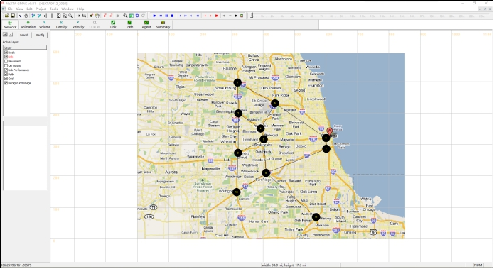

Step 5.2: Click the “Background Image” layer in the “Active layer panel” and
close it, as shown below:

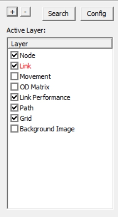

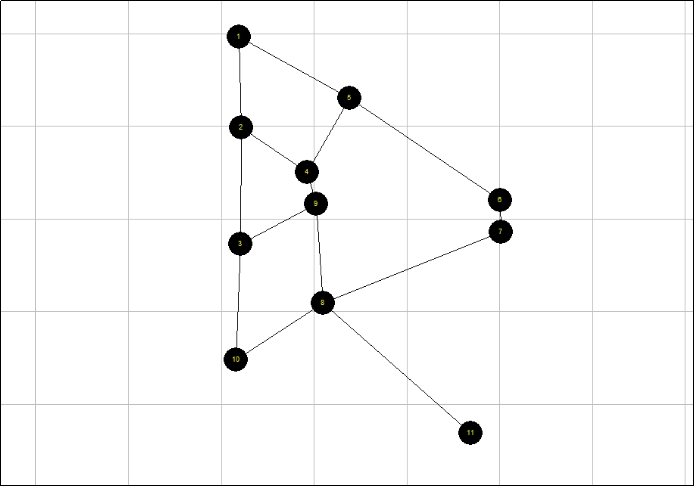

Step 6: Verify the network connectivity by searching the shortest path between a
pair of nodes

Step 6.1: Click the “Path” layer in the “Active layer panel”, as shown below:

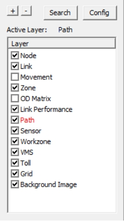

Fig 26 Select Path layer

Step 6.2: Click the right mouse on the location you want to start, and select
“Direction from here”. This should be on an existing node. Move the cursor to
the desired destination. Click the right mouse on the location you want to
arrive, and select “Direction to here”, as shown below:

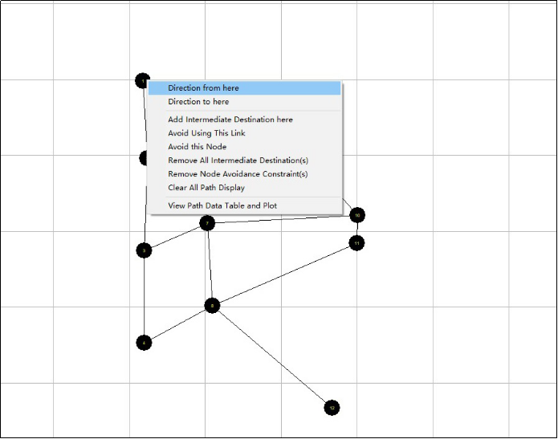

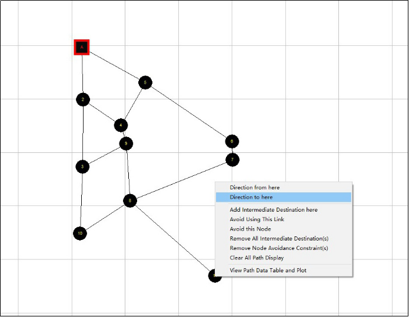

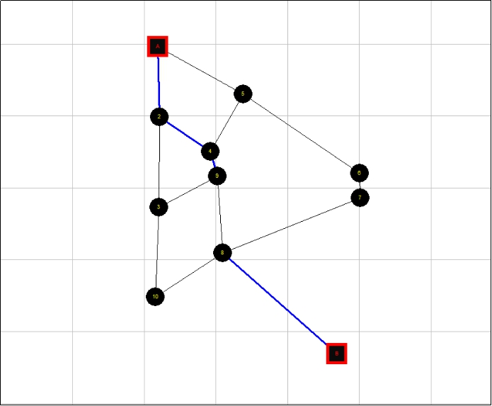

Step 6.3: Click the right mouse on the location where next to the path, and
select “View Path Data Table and Plot”, as shown below:

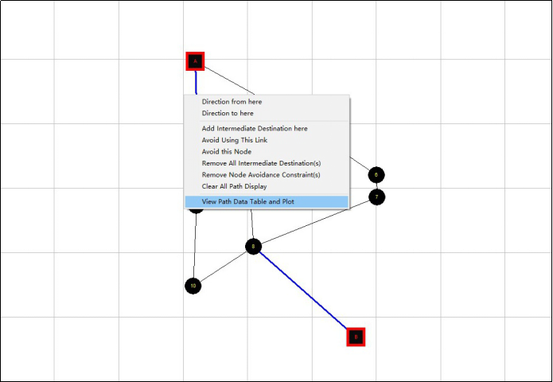

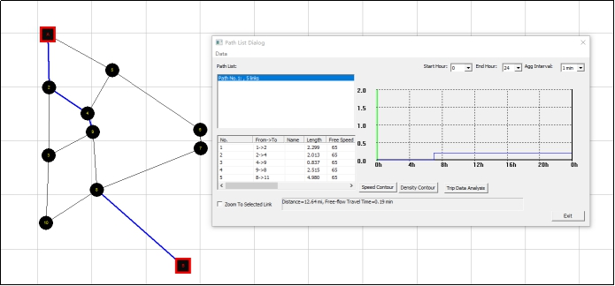

Step 6.4: Click the right mouse on the location where next to the path, and
chose “Clear All Path Display” to clear paths, as shown below:

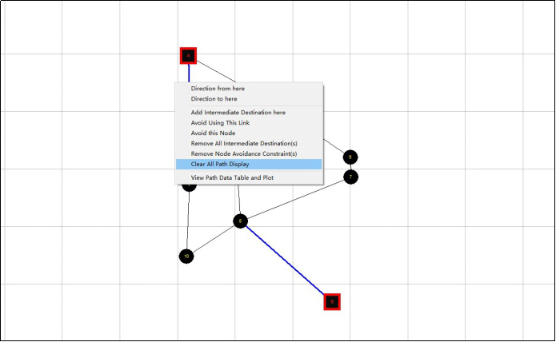

Step 7: Try an action of deleting a link

Related toolbar buttons:

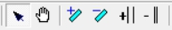

Step 7.1: Press the “mouse”

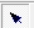

toggle button.

Step 7.2: Click the “link” layer in the “Active layer panel”, as shown below:

Step 7.3: Click the left mouse on the link which you want to delete, as shown
below:

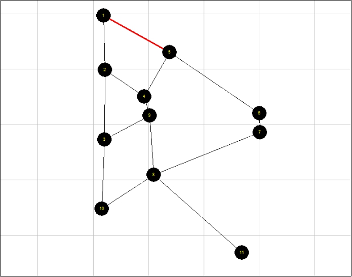

Step 7.4: Click the right mouse on the link which you want to delete and select
“Delete Link”, as shown below:

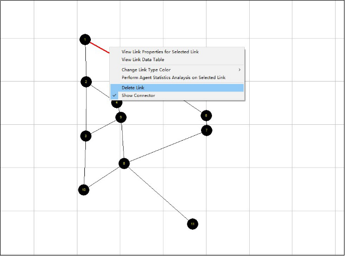

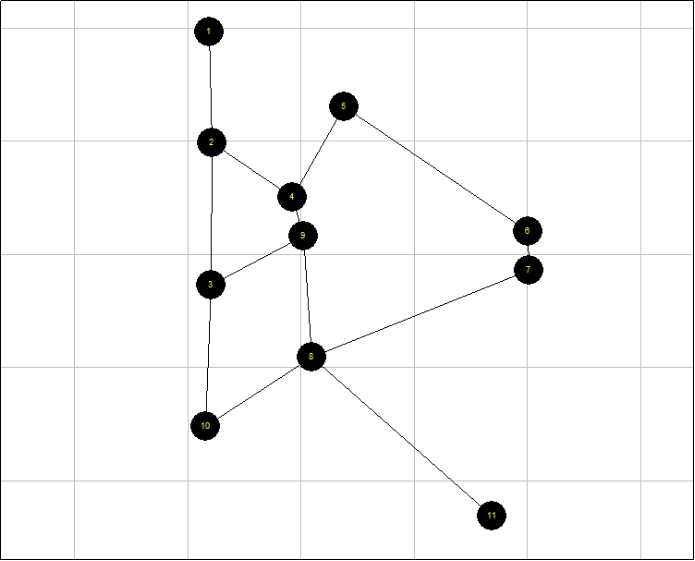

Step 8: Save GMNS data file

Related toolbar buttons:

Step 8.1: Click the “save”

toggle button and to save the files of “node.csv” and “link.csv” to the local
project folder.

## 9. Create network through QuickOSM QGIS Plugin

For this example, we will use the West Jordan network in Utah, United States.
Click on menu PluginsManage and install plugins to install QuickOSM plugin. Then
click on QuickOSM

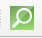

to download West Jordan network and Layer panel will show the obtained network.

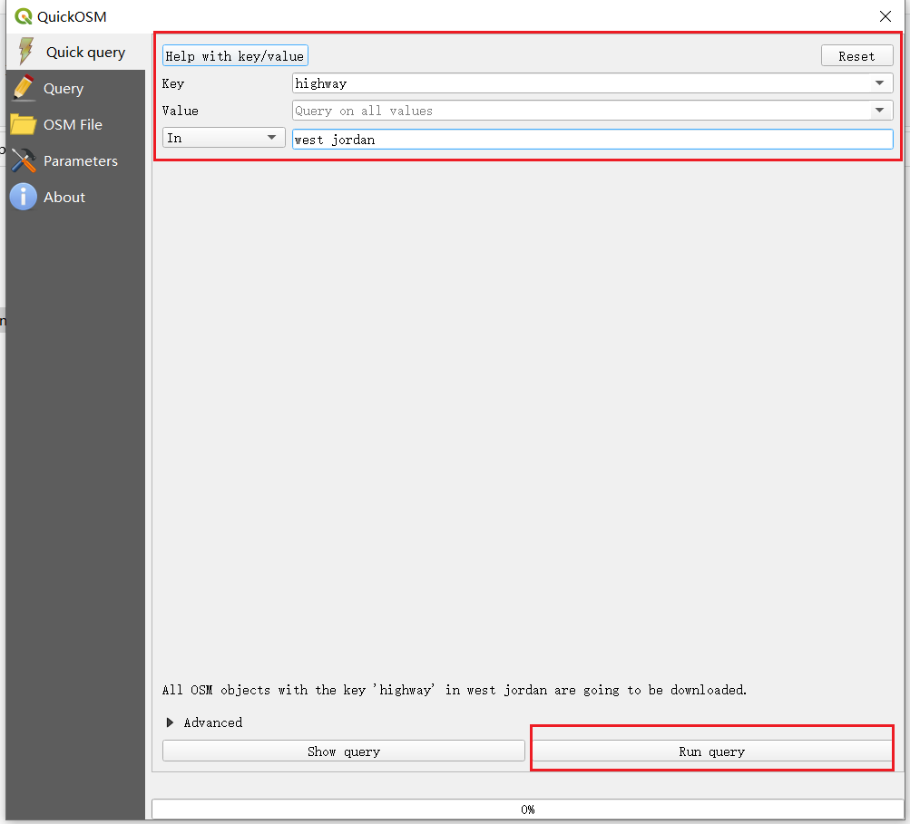

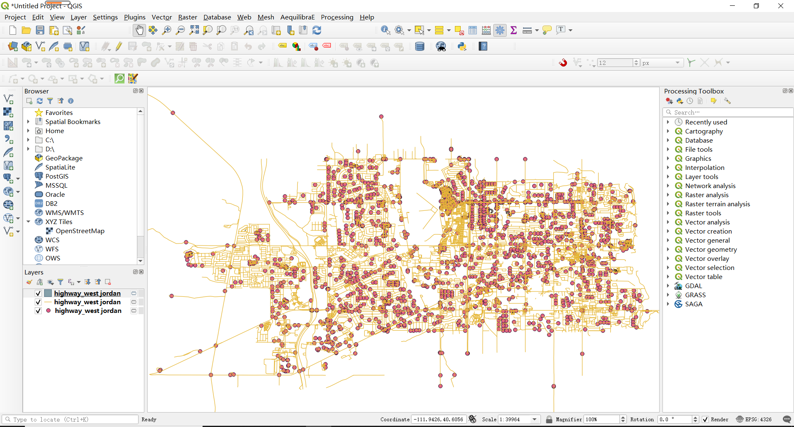

Then obtain geometry information of point and link layer. For x coordinate of
node layer

, right click on node layerOpen Attribute TableOpen field calculator

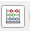

Create a new field Expression Geometry '\$x'. Similarly, you can obtain y
coordinate by '\$y' expression.

Additionally, you can obtain geometry by 'geom_to_wkt(\$geometry)' expression.
Note that, output field type is Text, unlimited length (text).

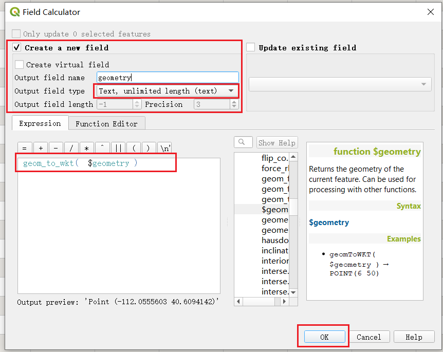

1.  Export shape file to GMNS file. Right click on node layerExportSave feature
    as and ensure Comma separated Value (CSV) format is selected. You now should
    have exported [node, link] files.

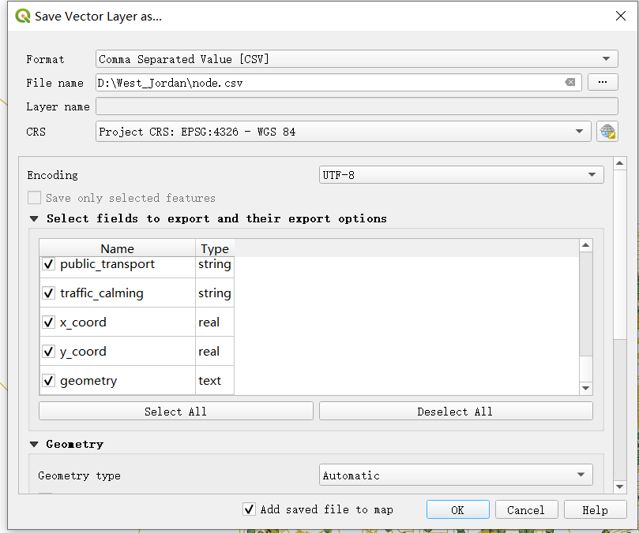

Then select necessary field to modify node.csv to adhere to the following
format.

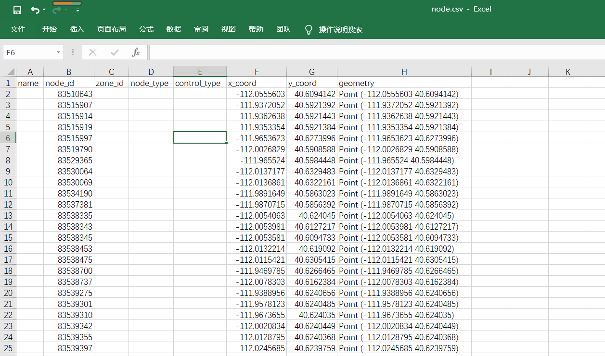

Similarly, for link layer, obtain geometry by 'geom_to_wkt(\$geometry)'
expression and export to link.csv.

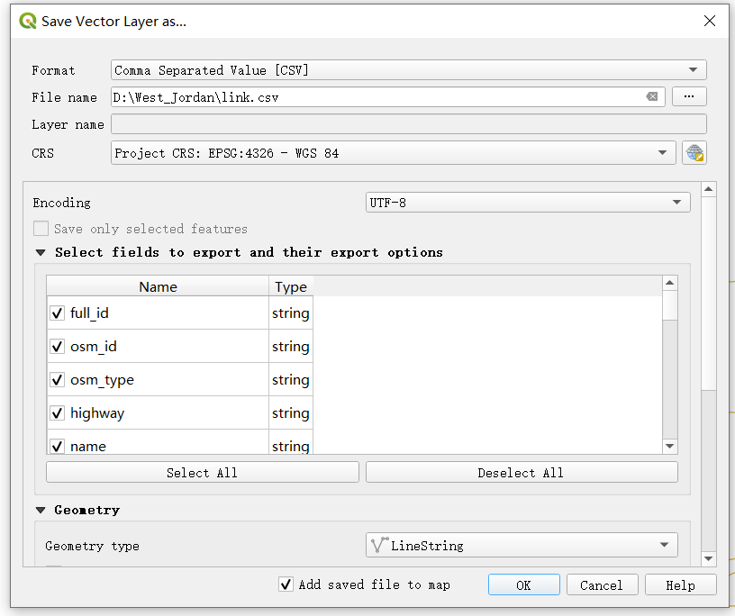

## 10. Create GMNS network from Openstreet Maps (OSM) file

## 11. Create multi-resolution GMNS network through open-source Ocean Tool
