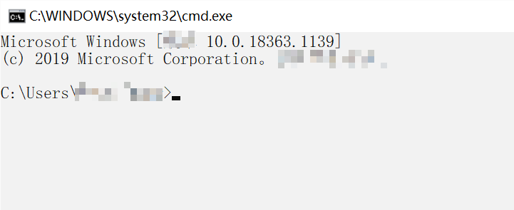
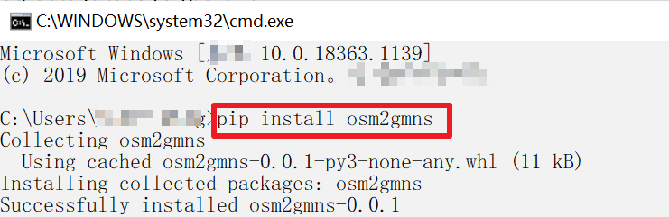
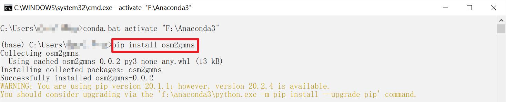
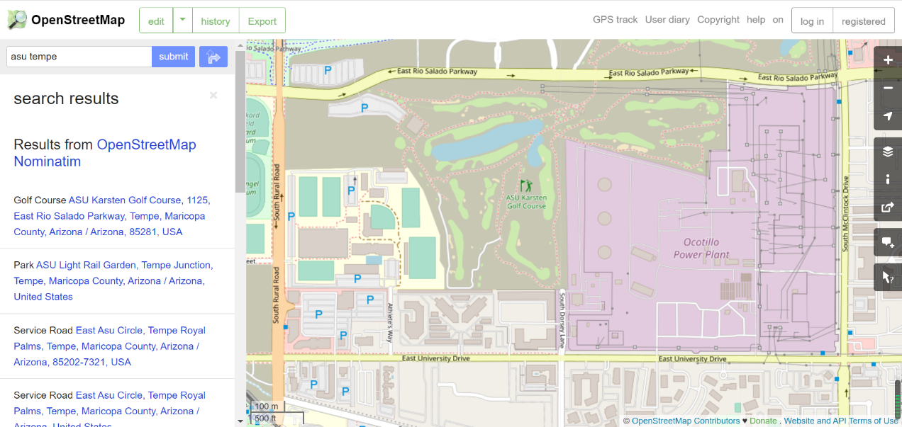
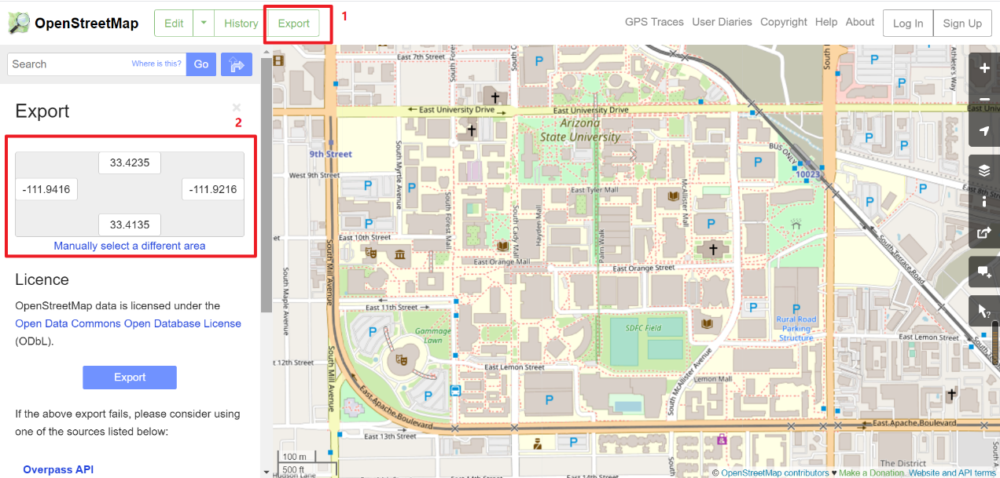
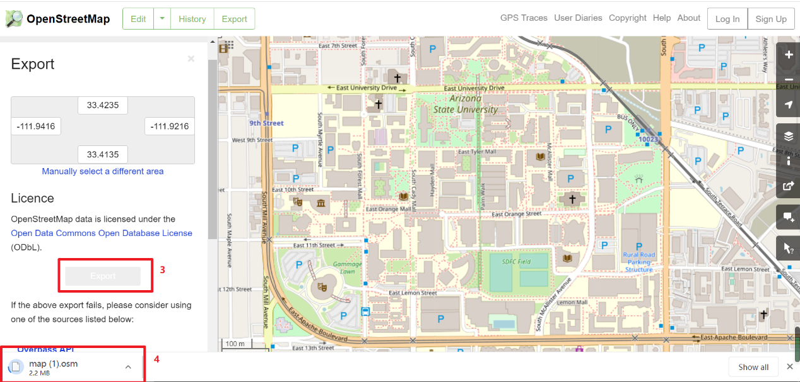
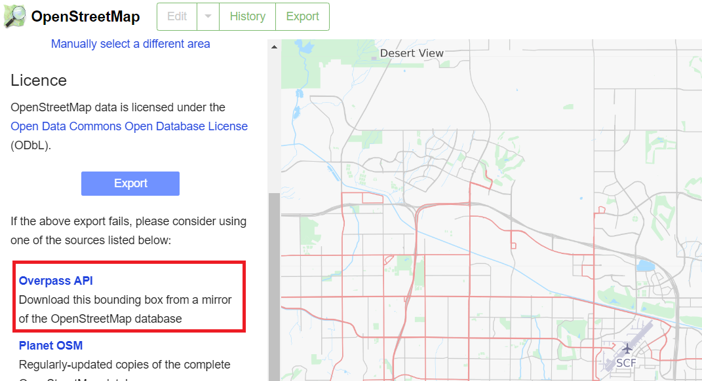
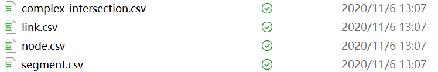
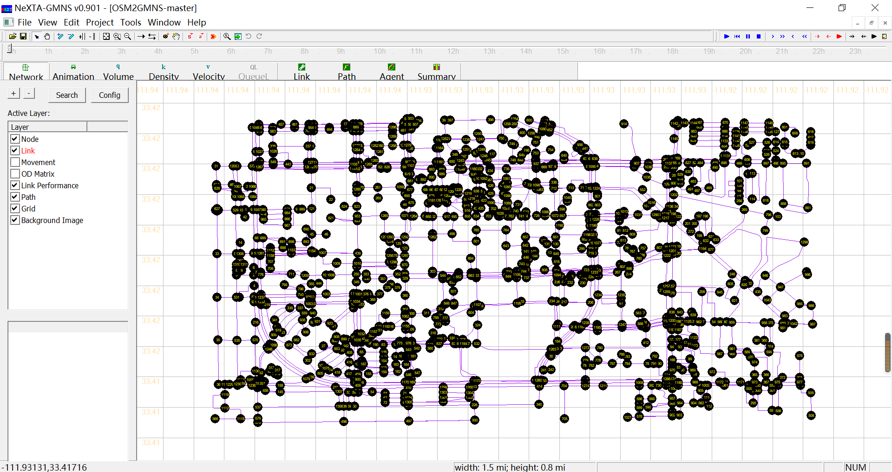

**OSM2GMNS**

**A tool for creating transportation network files in GMNS format from
OpenStreet Map**

OpenStreet Map (OSM) is a free, open-source, editable map website that can be
downloaded freely. This file introduces OSM2GMN, a data conversion tool,
OSM2GMNS, which can directly convert the OSM map data to node and link network
files in the GMNS format. For more information, readers can visit OpenStreet Map
website: <https://www.openstreetmap.org/>

**1. Understand GMNS**

GMNS(General Modeling Network Specification), proposed by the Zephyr Foundation,
aims to advance the field through flexible and efficient support, education,
guidance, encouragement, and incubation. Further details can be found at
https://zephyrtransport.org/projects/2-network-standard-and-tools/

Typically, a transportation network in GMNS format includes node.csv and
link.csv files, which have column inputs as shown in the following tables:

node.csv:

| name    | node_id | zone_id  | ctrl_type | node_type |
|---------|---------|----------|-----------|-----------|
| x_coord | y_coord | geometry |           |           |

link.csv:

| name      | road_link_id | from_node_id | to_node_id | dir_flag       |
|-----------|--------------|--------------|------------|----------------|
| length    | lanes        | free_speed   | capacity   | link_type_name |
| link_type | geometry     |              |            |                |

OSM typically has the following link types.

| link_type  | link_type_name |
|------------|----------------|
| 1          | motorway       |
| 2          | trunk          |
| 3          | primary        |
| 4          | secondary      |
| 5          | tertiary       |
| 6          | residential    |
| 7          | others         |

1.  **How to install OSM2GMNS?**

Further published details with OSM2GMNS can be found at
<https://pypi.org/project/osm2gmns/>.

*Before using this tool, please ensure that the python environment has been
installed.*

Step 1: Open windows terminal or anaconda command line.

Step 2: Type the command line at terminal or anaconda terminal:

*pip install osm2gmns*

The installation process takes about a few seconds to complete.

**3.How to use OSM2GMNS?**

Here, we use Tempe, AZ USA as an example to illustrate how to use OSM2GMNS tool.

**Step 3.1: Determining the research boundary of the map**

First, go to [www.openstreetmap.org](http://www.openstreetmap.org), and find the
location of interest, for example, Tempe campus of ASU, with its boundary shown
below.

Second, click on the export button on the top:

Then, click on the Export button in the middle to download an OSM data file.

For a very large area of interest, we also suggest users to click the link of
“overpass API” to obtain a map file for large regions. The data formats form
“overpass API” is not exactly the same as *.osm* format, but the OSM2GMNS tool
be applicable for these two data formats.

**Step 2: Executing the OSM2GMNS Python code**

Through a few lines of code, OSM2GMNS allows you to convert map.osm/map file in
OSM format into a network file in GMNS format.

*import osm2gmns as og*

*net = og.getNetFromOSMFile('map.osm')*

*og.outputNetToCSV(net)*

**Step 3: Check output files**

There are 4 output files, namely node.csv, link.csv, complex_intersection.csv,
and segment.csv from the OSM2GMNS package. The node and link attributes are
stored in node.csv and link.csv respectively, while some complex intersection
information such as the mapping between model nodes and main signal nodes is
represented in complex_intersection.csv and segment.csv. Some complex
intersection information that may be ignored or misidentified can be modified in
segment.csv.

**Step 4: Visualization in NEXTA**

You can open and visualize the traffic network project (node.csv) in NEXTA .

\*The potential next step is to visit the OCEAN tool for multi-resolution
network modeling and the NeXTA tool for transportation network simulation and
analysis.
