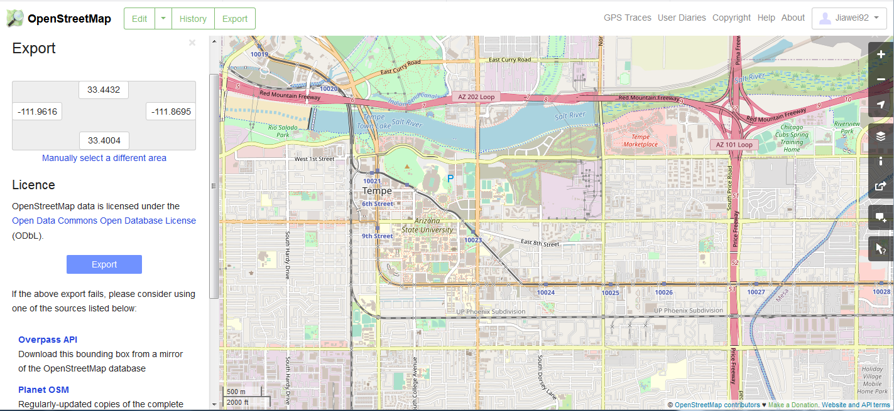
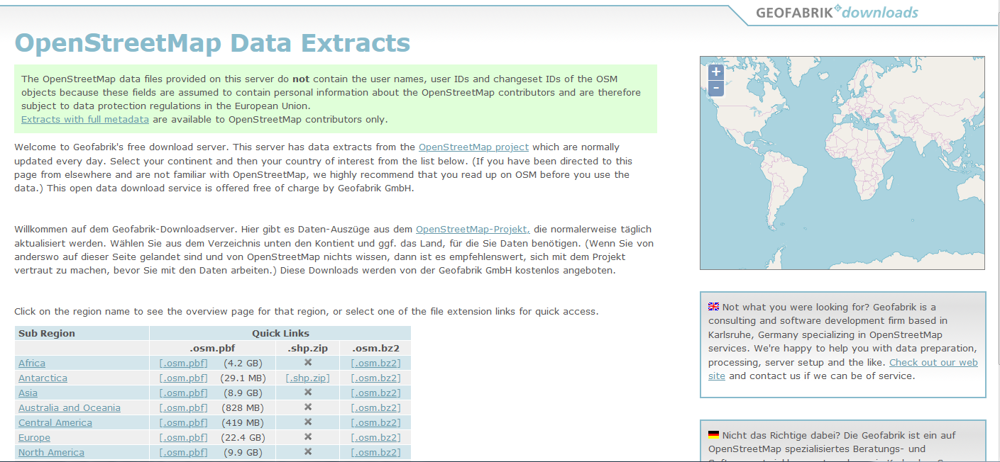
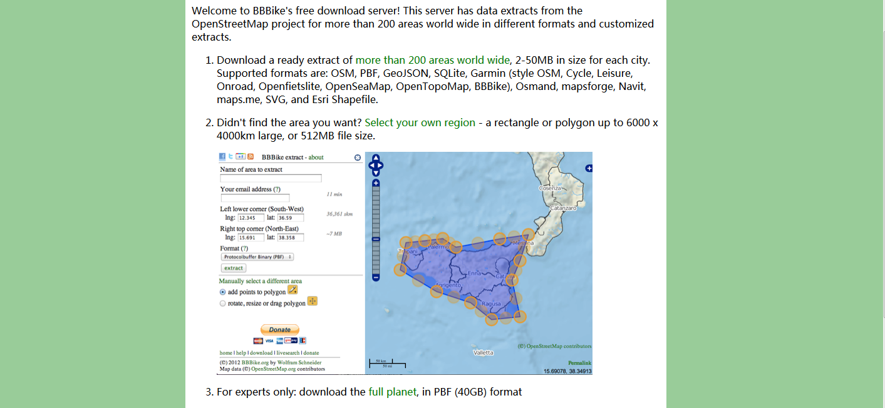
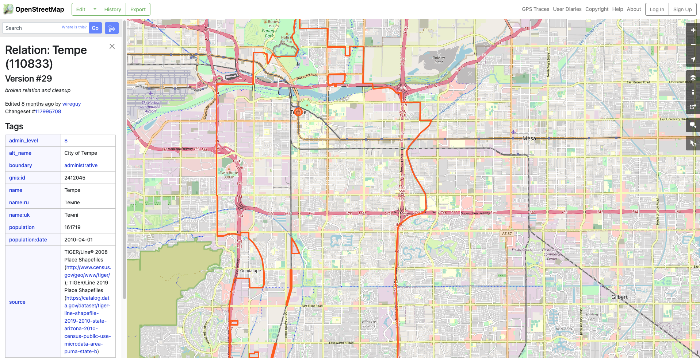

.. _section-get-osm-data:

============
Get OSM Data
============

osm2gmns requires OpenStreetMap data as input. 
Four options are provided to download OSM data. 
Users can choose the one that best suits their needs.

.. note::

    - The file formats of map data supported in osm2gmns include ``.osm``, ``.xml``, and ``.pbf``.

1) OpenStreetMap Homepage (Suitable for Smaller Areas)

Go to the OpenStreetMap `homepage`_.
Navigate to your area of interest.
Click the "Export" button at the top. You can adjust the bounding box manually if needed.
Click the blue "Export" button in the left panel to download the data.

Note that if the target area is too large, you may get an error message: "You requested too many nodes
(limit is 50000). Either request a smaller area, or use planet.osm". In this case, you can always click
``Overpass API`` to download the network you need via a mirror site.

    Downloading data directly from the OpenStreetMap website export tool

2) Geofabrik (Recommended for Administrative Regions)

Visit the `Geofabrik`_ download website.
Navigate through the continental and regional links to find your area.
Download the data extract for your specific administrative region.

Generally, there are multiple types of file format for users to choose when downloading map data.

    Downloading pre-packaged regional extracts from Geofabrik

3) BBBike (Custom Polygonal Areas)

Go to the `BBBike`_ download website.
Use the map interface to draw a custom polygon around your exact area of interest.
Enter your email address and select the desired format.
Submit the request; you will receive an email with a download link when the extract is ready.

    Selecting a custom area using the BBBike extract service

4) Overpass API (Programmatic Download by Relation ID)

osm2gmns includes a function ``downloadOSMData`` to download data directly via the Overpass API, 
using an OSM Relation ID.

Go to the OpenStreetMap `homepage`_.
Search for the administrative region or feature (can be a state, a city, or even an university).
Click on the correct search result.
The URL in your browser will contain the relation ID. The number is the ID. You can also often find it listed in the object's details/tags on the left panel.

    Finding the Relation ID for a region on OpenStreetMap

Use the following code to download the OSM data for the region using the relation ID.

.. code-block:: python

    >>> import osm2gmns as og

    >>> og.downloadOSMData(110833, 'tempe.osm')

.. _`homepage`: https://www.openstreetmap.org
.. _`Geofabrik`: https://download.geofabrik.de/
.. _`BBBike`: https://extract.bbbike.org/