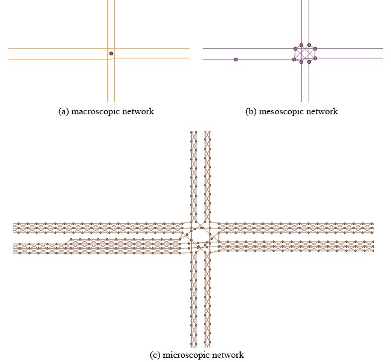

=========================
Multi-Resolution Modeling
=========================

Transportation networks can have different spatial granularities, each of them are 
intended to carry out various analysis, optimization, simulation, and management. 
In this section, we introduce the concept of multi-resolution network (MRM), which 
is one of the novelties of this package. Three types of networks, namely microscopic 
network, mesoscopic network, and macroscopic network, are refered to as the MRM.

This case study adopted and extended the GMNS-based representation for ABM and macro-, 
meso-, and microlayers of representation to achieve a hybrid-resolution network 
construction. The study adopted the GMNS standard for multiresolution transportation 
network representation, even though the developers mainly designed GMNS for macroscopic 
networks. As a result, this MRM-oriented study extends the GMNS-based representation 
for both mesoscopic and microscopic networks. In the long run, the researchers intend 
the proposed open-data and open-source framework to create a free open-package and 
open-data ecosystem, which could reduce the cost and complexity of managing computers 
and simulation models. The base representation of GMNS would allow different communities 
to build versions of a high-fidelity virtual model from different open and user-contributed 
data sources.

The osm2gmns package novelty transfer the macroscopic network into a mesoscopic network 
and a microscopic network, enabling practitioners and researchers to carry out various 
transportation planning, designing, optimization, simulation, and computation under 
different spatial granularities.

    Multi-resolution network representation

Macroscopic Network
===================================

- node.csv

.. table::
    :class: classic

    +---------------+---------------+----------+---------------------------------------------------------------+
    |     Field     |      Type     | Required?|                           Comments                            |
    +===============+===============+==========+===============================================================+
    |     name      |     string    |          |                                                               |
    +---------------+---------------+----------+---------------------------------------------------------------+
    |   node_id     |       int     |   yes    | unique key                                                    |
    +---------------+---------------+----------+---------------------------------------------------------------+
    |  osm_node_id  | string or int |          | corresponding node id in osm data                             |
    +---------------+---------------+----------+---------------------------------------------------------------+
    |  osm_highway  |     string    |          | point type in osm data                                        |
    +---------------+---------------+----------+---------------------------------------------------------------+
    |   zone_id     |       int     |          |                                                               |
    +---------------+---------------+----------+---------------------------------------------------------------+
    |   ctrl_type   |      enum     |          | signal; null                                                  |
    +---------------+---------------+----------+---------------------------------------------------------------+
    |   node_type   |     string    |          |                                                               |
    +---------------+---------------+----------+---------------------------------------------------------------+
    | activity_type |     string    |          | defined by adjacent links                                     |
    +---------------+---------------+----------+---------------------------------------------------------------+
    |  is_boundary  |      enum     |          | -1: boundary node only with incoming links; 0: no; 1: boundary|
    |               |               |          | node only with outgoing links; 2: boundary node with both     |
    |               |               |          | incoming and outgoing links                                   |
    +---------------+---------------+----------+---------------------------------------------------------------+
    |   x_coord     |     double    |   yes    | WGS 84 is used in osm                                         |
    +---------------+---------------+----------+---------------------------------------------------------------+
    |   y_coord     |     double    |   yes    | WGS 84 is used in osm                                         |
    +---------------+---------------+----------+---------------------------------------------------------------+
    |intersection_id|      int      |          | nodes belonging to one complex intersection have the same id  |
    +---------------+---------------+----------+---------------------------------------------------------------+
    |    poi_id     |      int      |          | id of the corresponding poi                                   |
    +---------------+---------------+----------+---------------------------------------------------------------+
    |     notes     |     string    |          |                                                               |
    +---------------+---------------+----------+---------------------------------------------------------------+

- link.csv

A link is an edge in a network, defined by the nodes it travels from and to. It may have associated geometry
information\ :sup:`[2]`. Similar to node.csv, We also added several new attributes to the link file. Detailed
link data dictionary is listed below.

.. table::
    :class: classic

    +----------------+---------------+----------+---------------------------------------------------------------+
    |      Field     |      Type     | Required?|                           Comments                            |
    +================+===============+==========+===============================================================+
    |      name      |     string    |          |                                                               |
    +----------------+---------------+----------+---------------------------------------------------------------+
    |    link_id     |      int      |   yes    | unique key                                                    |
    +----------------+---------------+----------+---------------------------------------------------------------+
    |   osm_way_id   | string or int |          | corresponding way id in osm data                              |
    +----------------+---------------+----------+---------------------------------------------------------------+
    |  from_node_id  |      int      |   yes    |                                                               |
    +----------------+---------------+----------+---------------------------------------------------------------+
    |   to_node_id   |      int      |   yes    |                                                               |
    +----------------+---------------+----------+---------------------------------------------------------------+
    |    dir_flag    |     enum      |          | 1: forward, -1: backward, 0:bidirectionial                    |
    +----------------+---------------+----------+---------------------------------------------------------------+
    |     length     |     float     |          | unit: meter                                                   |
    +----------------+---------------+----------+---------------------------------------------------------------+
    |      lanes     |      int      |          |                                                               |
    +----------------+---------------+----------+---------------------------------------------------------------+
    |   free_speed   |     float     |          | unit: kilometer/hour                                          |
    +----------------+---------------+----------+---------------------------------------------------------------+
    |    capacity    |     float     |          | unit: veh/hr/lane                                             |
    +----------------+---------------+----------+---------------------------------------------------------------+
    | link_type_name |     string    |          |                                                               |
    +----------------+---------------+----------+---------------------------------------------------------------+
    |    link_type   |       int     |          |                                                               |
    +----------------+---------------+----------+---------------------------------------------------------------+
    |    geometry    |     Geometry  |          | `wkt`_                                                        |
    +----------------+---------------+----------+---------------------------------------------------------------+
    |  allowed_uses  |      enum     |          | auto, bike, walk                                              |
    +----------------+---------------+----------+---------------------------------------------------------------+
    |   from_biway   |      bool     |          | 1: link created from a bidirectional way, 0: not              |
    +----------------+---------------+----------+---------------------------------------------------------------+
    |    is_link     |      bool     |          | 1: link connecting two roads, 0: not                          |
    +----------------+---------------+----------+---------------------------------------------------------------+

Other two optional files including ``movement.csv`` and ``segement.csv`` follow the exact same format as what
being defined in the GMMS standard. Readers can check the GMNS website for details.

In addition to the above files defined in the GMNS standard, osm2gmns can also produce ``poi.csv`` files
where point of interest information is stored. Detailed poi data dictionary is listed below.

.. table::
    :class: classic

    +-----------------+---------------+----------+---------------------------------------------------------------+
    |      Field      |      Type     | Required?|                           Comments                            |
    +=================+===============+==========+===============================================================+
    |       name      |     string    |          |                                                               |
    +-----------------+---------------+----------+---------------------------------------------------------------+
    |      poi_id     |      int      |   yes    | unique key                                                    |
    +-----------------+---------------+----------+---------------------------------------------------------------+
    |    osm_way_id   | string or int |          | corresponding way id in osm data                              |
    +-----------------+---------------+----------+---------------------------------------------------------------+
    | osm_relation_id | string or int |          | corresponding relation id in osm data                         |
    +-----------------+---------------+----------+---------------------------------------------------------------+
    |     building    |     string    |          | building tag in osm data                                      |
    +-----------------+---------------+----------+---------------------------------------------------------------+
    |     amenity     |     string    |          | amenity tag in osm data                                       |
    +-----------------+---------------+----------+---------------------------------------------------------------+
    |       way       |     string    |          | way tag in osm data                                           |
    +-----------------+---------------+----------+---------------------------------------------------------------+
    |     geometry    |    Geometry   |   yes    | `wkt`_                                                        |
    +-----------------+---------------+----------+---------------------------------------------------------------+
    |     centroid    |    Geometry   |          | `wkt`_                                                        |
    +-----------------+---------------+----------+---------------------------------------------------------------+
    |       area      |      float    |          | area of the poi. unit: square meter                           |
    +-----------------+---------------+----------+---------------------------------------------------------------+
    |     area_ft2    |      float    |          | area of the poi. unit: square feet                            |
    +-----------------+---------------+----------+---------------------------------------------------------------+

Mesoscopic Network
===================================

Compared to the original macroscopic network, the mesoscopic network has more detailed 
information in the intersections. In the mesoscopic network, the research team expanded 
each intersection represented by a node in the macroscopic network. The team built a 
connector link for each intersection movement to facilitate intersection modeling, 
especially for signalized intersections.

Macroscopic and mesoscopic networks have different link-level coding schemes. Macroscopic 
networks often represent a road segment between two adjacent intersections as a link; 
however, lane changes sometimes occur within a link, especially when close to intersections. 
Changes in the number of lanes result in capacity changes, but the link attributes cannot 
properly reflect these changes. This situation may bring inconvenience or even potential 
errors when performing network modeling. In the GMNS standard, the comma-separated values 
(CSV) file, segment.csv, stores lane changes. The research team split and converted each 
link with lane changes from a macroscopic network to multiple mesoscopic links so that 
each mesoscopic link has a homogeneous capacity.

- node.csv

.. table::
    :class: classic

    +-------------+---------------+----------+---------------------------------------------------------------+
    |    Field    |      Type     | Required?|                           Comments                            |
    +=============+===============+==========+===============================================================+
    |  node_id    |       int     |   yes    | unique key                                                    |
    +-------------+---------------+----------+---------------------------------------------------------------+
    |  zone_id    |       int     |          |                                                               |
    +-------------+---------------+----------+---------------------------------------------------------------+
    |  x_coord    |     double    |   yes    | WGS 84 is used in osm                                         |
    +-------------+---------------+----------+---------------------------------------------------------------+
    |  y_coord    |     double    |   yes    | WGS 84 is used in osm                                         |
    +-------------+---------------+----------+---------------------------------------------------------------+
    |macro_node_id|      int      |          | id of its parent macroscopic node                             |
    +-------------+---------------+----------+---------------------------------------------------------------+
    |macro_link_id|      int      |          | id of its parent macroscopic link                             |
    +-------------+---------------+----------+---------------------------------------------------------------+
    |activity_type|    string     |          |                                                               |
    +-------------+---------------+----------+---------------------------------------------------------------+
    | is_boundary |      enum     |          | -1: boundary node only with incoming links; 0: no; 1: boundary|
    |             |               |          | node only with outgoing links                                 |
    +-------------+---------------+----------+---------------------------------------------------------------+

- link.csv

A link is an edge in a network, defined by the nodes it travels from and to. It may have associated geometry
information\ :sup:`[2]`. Similar to node.csv, We also added several new attributes to the link file. Detailed
link data dictionary is listed below.

.. table::
    :class: classic

    +----------------+---------------+----------+---------------------------------------------------------------+
    |      Field     |      Type     | Required?|                           Comments                            |
    +================+===============+==========+===============================================================+
    |    link_id     |      int      |   yes    | unique key                                                    |
    +----------------+---------------+----------+---------------------------------------------------------------+
    |  from_node_id  |      int      |   yes    |                                                               |
    +----------------+---------------+----------+---------------------------------------------------------------+
    |   to_node_id   |      int      |   yes    |                                                               |
    +----------------+---------------+----------+---------------------------------------------------------------+
    |    dir_flag    |     enum      |          | 1: forward, -1: backward, 0:bidirectionial                    |
    +----------------+---------------+----------+---------------------------------------------------------------+
    |     length     |     float     |          | unit: meter                                                   |
    +----------------+---------------+----------+---------------------------------------------------------------+
    |      lanes     |      int      |          |                                                               |
    +----------------+---------------+----------+---------------------------------------------------------------+
    |   free_speed   |     float     |          | unit: kilometer/hour                                          |
    +----------------+---------------+----------+---------------------------------------------------------------+
    |    capacity    |     float     |          | unit: veh/hr/lane                                             |
    +----------------+---------------+----------+---------------------------------------------------------------+
    | link_type_name |     string    |          |                                                               |
    +----------------+---------------+----------+---------------------------------------------------------------+
    |    link_type   |       int     |          |                                                               |
    +----------------+---------------+----------+---------------------------------------------------------------+
    |    geometry    |     Geometry  |          | `wkt`_                                                        |
    +----------------+---------------+----------+---------------------------------------------------------------+
    |  macro_node_id |      int      |          | id of its parent macroscopic node                             |
    +----------------+---------------+----------+---------------------------------------------------------------+
    |  macro_link_id |      int      |          | id of its parent macroscopic link                             |
    +----------------+---------------+----------+---------------------------------------------------------------+
    |   mvmt_txt_id  |      enum     |          | NBL, NBT, NBR, NBU, SBL, SBT, SBR, SBU, EBL, EBT, EBR, EBU,   |
    |                |               |          | WBL, WBT, WBR, WBU                                            |
    +----------------+---------------+----------+---------------------------------------------------------------+
    |  allowed_uses  |      enum     |          | auto, bike, walk                                              |
    +----------------+---------------+----------+---------------------------------------------------------------+

Microscopic Network
===================================

In the Maryland case study, microscopic networks used a lane-by-lane, cell-based representation. 
Instead of a conceptual line segment, lanes represented each link. The research team further 
discretized lanes into small cells to accurately describe vehicle motion status when moving on 
the road. The team also created changing cells to enable vehicles to switch trajectories between 
lanes. Users can customize the length of cells to accommodate different modeling needs.

- node.csv

.. table::
    :class: classic

    +-------------+---------------+----------+---------------------------------------------------------------+
    |    Field    |      Type     | Required?|                           Comments                            |
    +=============+===============+==========+===============================================================+
    |  node_id    |       int     |   yes    | unique key                                                    |
    +-------------+---------------+----------+---------------------------------------------------------------+
    |  zone_id    |       int     |          |                                                               |
    +-------------+---------------+----------+---------------------------------------------------------------+
    |  x_coord    |     double    |   yes    | WGS 84 is used in osm                                         |
    +-------------+---------------+----------+---------------------------------------------------------------+
    |  y_coord    |     double    |   yes    | WGS 84 is used in osm                                         |
    +-------------+---------------+----------+---------------------------------------------------------------+
    | meso_link_id|      int      |          | id of its parent mesoscopic link                              |
    +-------------+---------------+----------+---------------------------------------------------------------+
    |    lane_no  |      int      |          | start from 1 from inner side to outer side                    |
    +-------------+---------------+----------+---------------------------------------------------------------+
    | is_boundary |      enum     |          | -1: boundary node only with incoming links; 0: no; 1: boundary|
    |             |               |          | node only with outgoing links                                 |
    +-------------+---------------+----------+---------------------------------------------------------------+

- link.csv

A link is an edge in a network, defined by the nodes it travels from and to. It may have associated geometry
information\ :sup:`[2]`. Similar to node.csv, We also added several new attributes to the link file. Detailed
link data dictionary is listed below.

.. table::
    :class: classic

    +----------------+---------------+----------+---------------------------------------------------------------+
    |      Field     |      Type     | Required?|                           Comments                            |
    +================+===============+==========+===============================================================+
    |    link_id     |      int      |   yes    | unique key                                                    |
    +----------------+---------------+----------+---------------------------------------------------------------+
    |  from_node_id  |      int      |   yes    |                                                               |
    +----------------+---------------+----------+---------------------------------------------------------------+
    |   to_node_id   |      int      |   yes    |                                                               |
    +----------------+---------------+----------+---------------------------------------------------------------+
    |    dir_flag    |     enum      |          | 1: forward, -1: backward, 0:bidirectionial                    |
    +----------------+---------------+----------+---------------------------------------------------------------+
    |     length     |     float     |          | unit: meter                                                   |
    +----------------+---------------+----------+---------------------------------------------------------------+
    |      lanes     |      int      |          |                                                               |
    +----------------+---------------+----------+---------------------------------------------------------------+
    |   free_speed   |     float     |          | unit: kilometer/hour                                          |
    +----------------+---------------+----------+---------------------------------------------------------------+
    |    capacity    |     float     |          | unit: veh/hr/lane                                             |
    +----------------+---------------+----------+---------------------------------------------------------------+
    | link_type_name |     string    |          |                                                               |
    +----------------+---------------+----------+---------------------------------------------------------------+
    |    link_type   |       int     |          |                                                               |
    +----------------+---------------+----------+---------------------------------------------------------------+
    |    geometry    |     Geometry  |          | `wkt`_                                                        |
    +----------------+---------------+----------+---------------------------------------------------------------+
    |  macro_node_id |      int      |          | id of its parent macroscopic node                             |
    +----------------+---------------+----------+---------------------------------------------------------------+
    |  macro_link_id |      int      |          | id of its parent macroscopic link                             |
    +----------------+---------------+----------+---------------------------------------------------------------+
    |  meso_link_id  |      int      |          | id of its parent mesoscopic link                              |
    +----------------+---------------+----------+---------------------------------------------------------------+
    |    cell_type   |     enum      |          | 1: traveling cell, 2: lane changing cell                      |
    +----------------+---------------+----------+---------------------------------------------------------------+
    |additional_cost |     float     |          |                                                               |
    +----------------+---------------+----------+---------------------------------------------------------------+
    |     lane_no    |      int      |          | start from 1 from inner side to outer side                    |
    +----------------+---------------+----------+---------------------------------------------------------------+
    |   mvmt_txt_id  |      enum     |          | NBL, NBT, NBR, NBU, SBL, SBT, SBR, SBU, EBL, EBT, EBR, EBU,   |
    |                |               |          | WBL, WBT, WBR, WBU                                            |
    +----------------+---------------+----------+---------------------------------------------------------------+
    |  allowed_uses  |      enum     |          | auto, bike, walk                                              |
    +----------------+---------------+----------+---------------------------------------------------------------+

\ :sup:`[1]` https://github.com/zephyr-data-specs/GMNS/blob/master/Specification/Node.md

\ :sup:`[2]` https://github.com/zephyr-data-specs/GMNS/blob/master/Specification/Link.md

.. _`wkt`: https://en.wikipedia.org/wiki/Well-known_text_representation_of_geometry