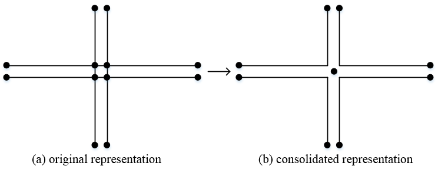
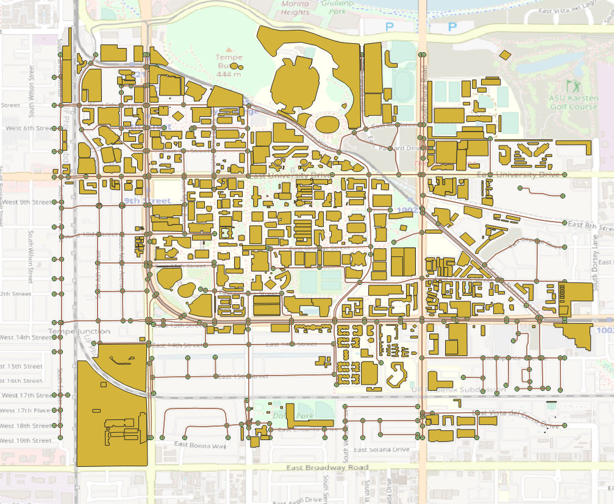

===========
Quick Start
===========

This section provides introductory examples to demonstrate the core workflow of using 
osm2gmns for generating, processing, and exporting transportation networks.

osm2gmns processes network data from local OpenStreetMap files (.osm, .xml, or .pbf 
formats). Therefore, the first step is always to download the OSM data for your region 
of interest. Several methods exist for this, detailed in the :ref:`section-get-osm-data` 
section.

In this guide, we use the area around Arizona State University, Tempe Campus as an 
example to introduce some major functions in osm2gmns. The downloaded osm file is named 
as ``asu.osm``.

Basic Network Generation
=========================

Load a network from an OSM file and export it to GMNS-compliant CSV files.

.. code-block:: python

    >>> import osm2gmns as og
    >>> net = og.getNetFromFile('asu.osm')
    >>> og.outputNetToCSV(net)

By default, ``getNetFromFile`` extracts the drivable network (mode_types='auto'). 
In the example, the output folder is set as the current working directory. Users 
can specify the output folder by using the argument ``output_folder``. The output 
files include ``node.csv`` and ``link.csv``, which contain node and link information 
respectively.

Consolidate Intersections
=========================

In OpenStreetMap, large intersections are often mapped using multiple nodes. 
For many traffic analysis tasks, it's beneficial to represent such intersections 
as single nodes. The ``consolidateComplexIntersections`` function achieves this, 
typically focusing on signalized junctions.

.. code-block:: python

    >>> net = og.getNetFromFile('asu.osm')
    >>> og.consolidateComplexIntersections(net, auto_identify=True)
    >>> og.outputNetToCSV(net)

    Complex intersection consolidation

The resulting network can be visualized using tools like `QGIS`_ or `NeXTA`_
to inspect the consolidated intersections.

Network Types and POI
=========================

osm2gmns supports five different mode types, including ``auto``, ``bike``, ``walk``, ``railway``, ``aeroway``.
Users can get different types of networks by specifying the argument ``mode_types``  (default: ``auto``).

.. code-block:: python

    >>> # obtain the network for bike
    >>> net = og.getNetFromFile('asu.osm', mode_types='bike')
    >>> # obtain the network for walk and bike
    >>> net = og.getNetFromFile('asu.osm', mode_types=['walk','bike'])
    >>> # obtain the network for auto, railway and aeroway
    >>> net = og.getNetFromFile('asu.osm', mode_types=['auto','railway','aeroway'])

Obtain POIs (Point of Interest) from osm map data.

.. code-block:: python

    >>> net = og.getNetFromFile('asu.osm', POI=True)

If ``POI=True`` is used, ``outputNetToCSV`` will generate an additional ``poi.csv`` 
file alongside ``node.csv`` and ``link.csv``.

    Network with POIs

Generate Multi-Resolution Networks
==================================

Multi-resolution (MRM) functionalities are currently not available in v1.x.
For MRM, users can use the latest v0.x. Check the v0.x `user's guide`_ for details.

.. _`QGIS`: https://qgis.org
.. _`NeXTA`: https://github.com/asu-trans-ai-lab/NeXTA4GMNS
.. _`user's guide`: https://osm2gmns.readthedocs.io/en/v0.x