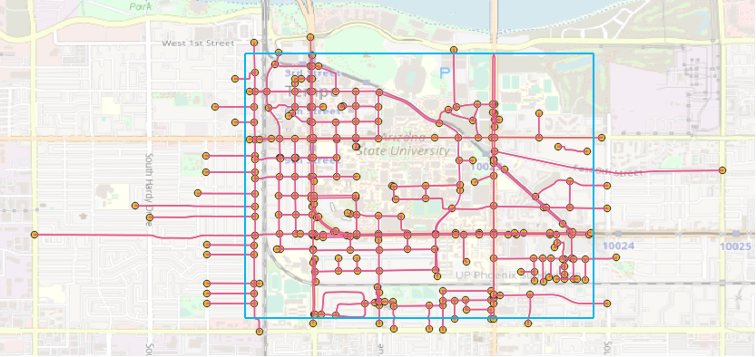
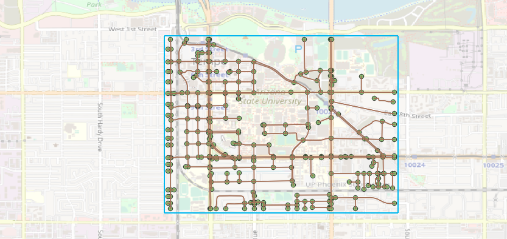
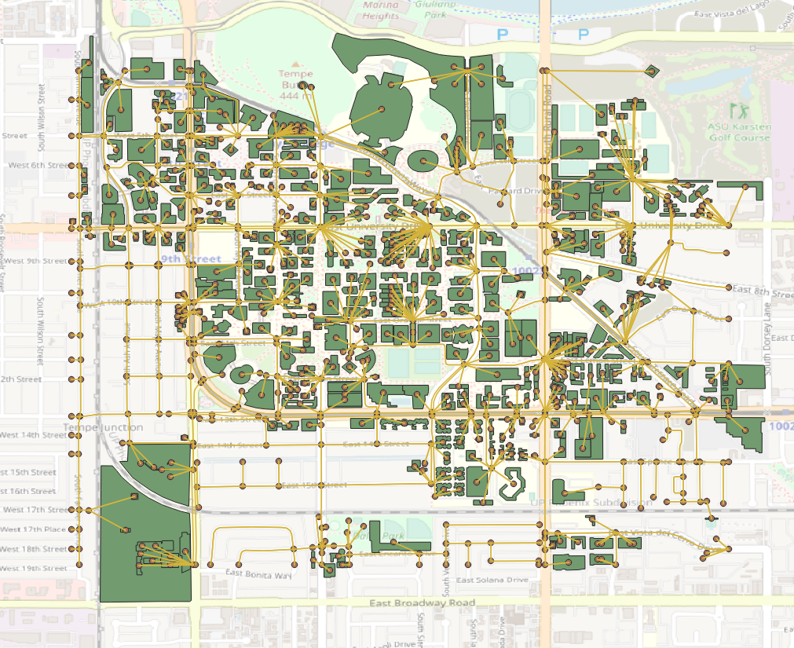

===========
Quick Start
===========

In this section, some examples are provided to quickly show how to use osm2gmns to generate, manipulate
and output networks.

Download OSM Data
=========================

To reduce uncertainties while directly parsing network data from the osm server via APIs, osm2gmns uses downloaded
osm files to extract useful network information. As a result, the first step is preparing osm files.

Thanks to the open-source nature of OpenStreetMap, there are lots of APIs and mirror sites that we can use to
download osm map data. We list several popular sites here for users to choose.

1) OpenStreetMap Homepage

On OpenStreetMap `homepage`_, click the ``Export`` button to enter Export mode. Before downloading,
you may need to span and zoom in/out the map to make sure that your target area is properly shown on the screen.
Or, you can use ``Manually select a different area`` to select your area more precisely. Click the ``Export``
button in blue to export the network you want.

Note that if the target area is too large, you may get an error message: "You requested too many nodes
(limit is 50000). Either request a smaller area, or use planet.osm". In this case, you can always click
``Overpass API`` to download the network you need via a mirror site.

.. figure:: _images/osmhp.png
    :name: osmhp_pic
    :align: center
    :width: 100%

    Download osm data from OpenStreetMap homepage

2) Geofabrik

Different from the way of downloading map data from OpenStreetMap homepage, `Geofabrik`_ enables you to
download network data for administrative areas. On OpenStreetMap homepage, we can only download areas
defined by rectangles. In Geofabrik, you can click the corresponding quick link of your interested
region to download the map data you need. You can always click the name of regions to check if sub region
data are available.

Generally, there are three types of file format for users to choose when downloading map data.
osm2gmns supports ``.pbf`` and ``.osm`` files. In osm2gmns, networks stored in ``.osm`` files
are parsed more quickly than those stored in ``.pbf`` files. However, compared with ``.pbf`` files,
``.osm`` files take much more hard disk space to store networks and much more space in RAM while parsing.

.. figure:: _images/geofabrik.png
    :name: geofabrik_pic
    :align: center
    :width: 100%

    Download osm data from Geofabrik

3) BBBike

If your target area is neither an administrative region nor a rectangle, `BBBike`_ may be a good choice.
`BBBike`_ enables you to select your region using a polygon. `BBBike`_ supports numerous file formats
to output and store network data. Users can select a proper one according to their requirements.

.. figure:: _images/bbbike.png
    :name: bbbike_pic
    :align: center
    :width: 100%

    Download osm data from BBBike

.. note::

    - The file formats of map data supported in osm2gmns include ``.osm``, ``.xml``, and ``.pbf``.

4) Overpass API

osm2gmns also enables users to download OSM data within the region of interest using a built-in function.
A region can be a state, city, or even university. On OpenStreetMap `homepage`_, search the region name to get
its unique relation id. The following example shows how to download Tempe city OSM data using function
``downloadOSMData``.

.. figure:: _images/osm_id.png
    :name: osm_id
    :align: center
    :width: 100%

    Get region id from OpenStreetMap homepage

.. code-block:: python

    >>> import osm2gmns as og

    >>> og.downloadOSMData(110833, 'tempe.osm')

Parse OSM Data
=========================

We use the region around Arizona State University, Tempe Campus in this guide to introduce some major functions
in osm2gmns.

Obtain a transportation network from an osm file.

.. code-block:: python

    >>> import osm2gmns as og

    >>> net = og.getNetFromFile('asu.osm')

A link will be included in the network file from osm database if part of the link lies in the region
that users selected. If argument ``strict_mode`` (default: ``True``) is set as ``True``, link segments that
outside the region will be cut off when parsing osm data. If argument ``strict_mode`` is set as ``False``,
all links in the network file will be imported.

    Parsed network with ``strict_mode=False``

    Parsed network with ``strict_mode=True``

One loaded network may contain several sub networks, with some sub networks not accessible from others.
In most cases, these sub networks include a large sub network and some isolated nodes or links. When the
number of nodes of a sub network is less than argument ``min_nodes`` (default: ``1``), this sub network
will be discarded.

Users can use argument ``combine`` (default: ``False``) to control short link combinations. If ``combine``
is enabled, two-degree nodes (nodes with one incoming link and one outgoing link) will be removed, and two adjacent
links will be combined to generate a new link.

Notice that most links do not have "lanes" information in the map data provided by OpenStreetMap. Thus,
we use a default lanes dictionary for each link type in osm2gmns. By setting ``default_lanes`` (default:  ``False``)
as ``True``, the default value will be assigned to a link if it does not come with "lanes" information. The
default dictionary in osm2gmns:

.. code-block:: python

    default_lanes_dict = {'motorway': 4, 'trunk': 3, 'primary': 3, 'secondary': 2, 'tertiary': 2,
                          'residential': 1, 'service': 1, 'cycleway':1, 'footway':1, 'track':1,
                          'unclassified': 1, 'connector': 2}
    default_speed_dict = {'motorway': 120, 'trunk': 100, 'primary': 80, 'secondary': 60, 'tertiary': 40,
                          'residential': 30, 'service': 30, 'cycleway':5, 'footway':5, 'track':30,
                          'unclassified': 30, 'connector':120}
    default_capacity_dict = {'motorway': 2300, 'trunk': 2200, 'primary': 1800, 'secondary': 1600, 'tertiary': 1200,
                          'residential': 1000, 'service': 800, 'cycleway':800, 'footway':800, 'track':800,
                          'unclassified': 800, 'connector':9999}

``default_lanes`` also accepts a dictionary. In that case, osm2gmns will use the dictionary provided by users
to update the default dictionary.

A similar fashion applies for argument ``default_speed`` and ``default_capacity``.

Output Networks to CSV
=========================

Based on the ``net`` instance obtained from the last step, ``outputNetToCSV`` can be used to output the parsed network
to CSV files.

.. code-block:: python

    >>> og.outputNetToCSV(net)

Users can use argument ``output_folder`` to specify the folder to store output files. Node information will be
written to ``node.csv``, while link information will be written to ``link.csv``.

If argument ``combine`` is set as ``True`` when parsing the network, ``segment.csv`` will also be created to
store lane changes in links. Lane changes occur when combining two adjacent links with different lanes in the
combination step.

Consolidate Intersections
=========================

In OpenStreetMap, one large intersection is often represented by multiple nodes. This structure brings some
difficulties when performing traffic-oriented modelings. osm2gmns enables users to consolidate intersections 
that are original represented by multiple nodes into a single node.

.. code-block:: python

    >>> net = og.getNetFromFile('asu.osm')
    >>> og.consolidateComplexIntersections(net, auto_identify=True)
    >>> og.outputNetToCSV(net)

.. figure:: _images/consolidation.png
    :name: consolidate_pic
    :align: center
    :width: 100%

    Complex intersection consolidation

Users can also check and revise complex intersection identification results first, and then conduct the consolidation
operation to obtain more reasonable outcomes.

.. code-block:: python

    >>> net = og.getNetFromFile('asu.osm')
    >>> og.consolidateComplexIntersections(net, auto_identify=True)
    >>> og.outputNetToCSV(net)
    >>> # check the consolidated network, and revise the column "intersection_id" in node.csv if necessary
    >>> net = og.loadNetFromCSV(node_file='node.csv', link_file='link.csv')
    >>> og.consolidateComplexIntersections(net, auto_identify=False)
    >>> og.outputNetToCSV(net, output_folder='consolidated')

Network Types and POI
=========================

osm2gmns supports five different network types, including ``auto``, ``bike``, ``walk``, ``railway``, ``aeroway``.
Users can get different types of networks by specifying the argument ``network_types``  (default: ``(auto,)``).

.. code-block:: python

    >>> # obtain the network for bike
    >>> net = og.getNetFromFile('asu.osm', network_types='bike')
    >>> # obtain the network for walk and bike
    >>> net = og.getNetFromFile('asu.osm', network_types=('walk','bike'))
    >>> # obtain the network for auto, railway and aeroway
    >>> net = og.getNetFromFile('asu.osm', network_types=('auto','railway','aeroway'))

Obtain POIs (Point of Interest) from osm map data.

.. code-block:: python

    >>> net = og.getNetFromFile('asu.osm', POI=True)

If ``POI`` (default: ``False``) is set as ``True``, a file named ``poi.csv`` will be generated when outputting
a network using function ``outputNetToCSV``.

.. figure:: _images/poi1.png
    :name: poi1
    :align: center
    :width: 100%

    Network with POIs

Connect POIs with transportation network.

.. code-block:: python

    >>> net = og.getNetFromFile('asu.osm', POI=True)
    >>> og.connectPOIWithNet(net)

By using function ``connectPOIWithNet``, a node located at the centroid of each POI will be generated to
represent the POI. Then connector links will be built to connect the POI node with the nearest node in the
transportation network.

    Connect POIs with network

Generate Multi-Resolution Networks
==================================

osm2gmns can generate the corresponding mesoscopic and microscopic network for any macroscopic networks in GMNS format.

Generate multi-resolution networks from an osm file.

.. code-block:: python

    >>> net = og.getNetFromFile('asu.osm', default_lanes=True)
    >>> og.consolidateComplexIntersections(net, auto_identify=True)
    >>> og.buildMultiResolutionNets(net)
    >>> og.outputNetToCSV(net)

The generated multi-resolution network is available at 

Generate multi-resolution networks from a macroscopic network provided by user (movement information is automatically
generated by osm2gmns).

.. code-block:: python

    >>> net = og.loadNetFromCSV(node_file='node.csv', link_file='link.csv')
    >>> og.consolidateComplexIntersections(net, auto_identify=True)
    >>> og.buildMultiResolutionNets(net)
    >>> og.outputNetToCSV(net)

Generate multi-resolution networks from a macroscopic network provided by user (movement information is from the user).

.. code-block:: python

    >>> net = og.loadNetFromCSV(node_file='node.csv', link_file='link.csv', movement_file='movement.csv')
    >>> og.consolidateComplexIntersections(net, auto_identify=True)
    >>> og.buildMultiResolutionNets(net)
    >>> og.outputNetToCSV(net)

.. _`homepage`: https://www.openstreetmap.org
.. _`Geofabrik`: https://download.geofabrik.de/
.. _`BBBike`: https://extract.bbbike.org/
