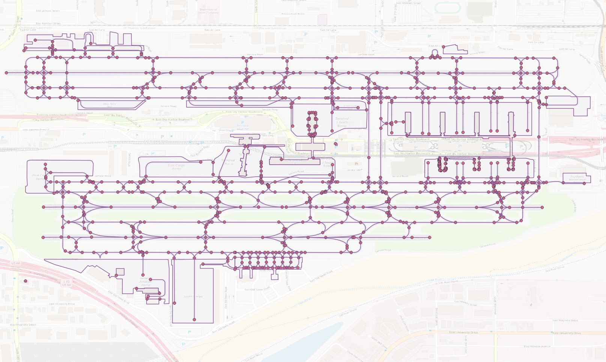
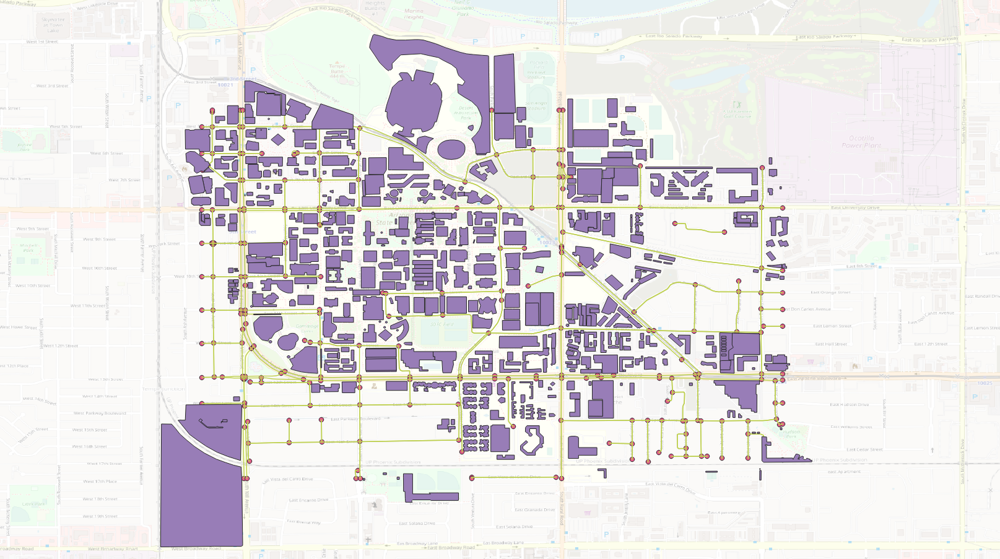
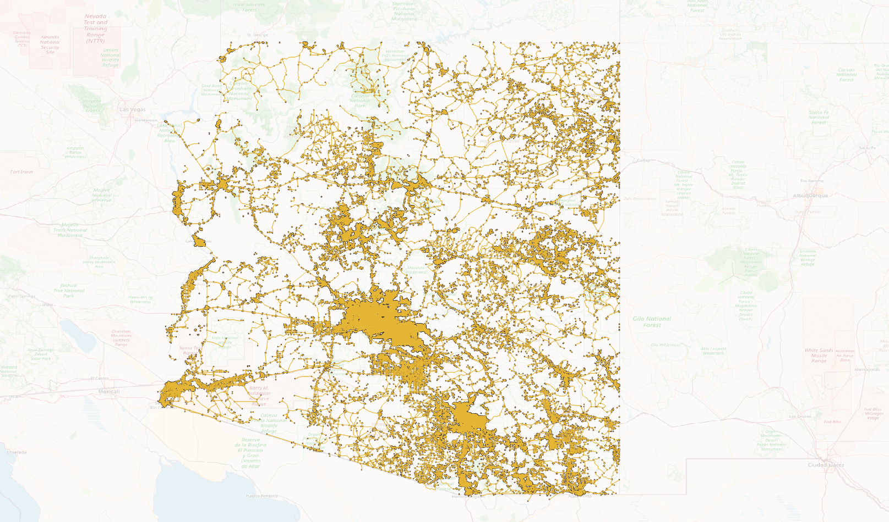
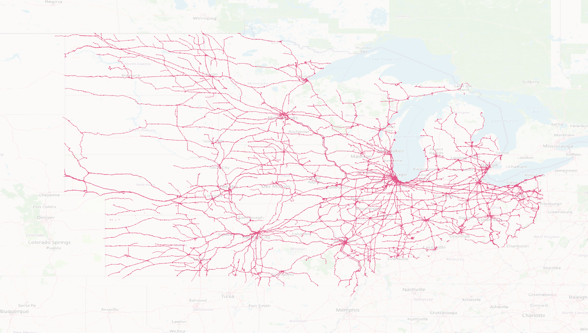
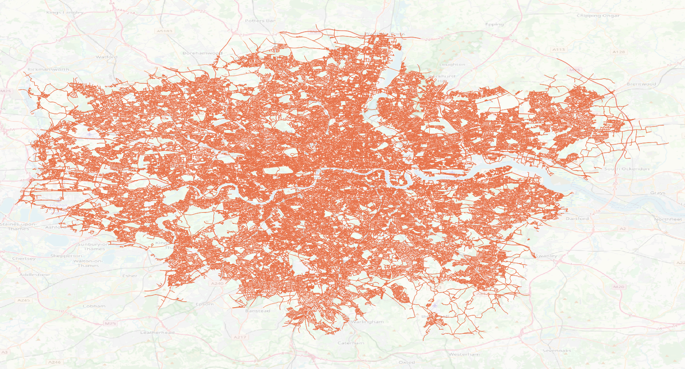
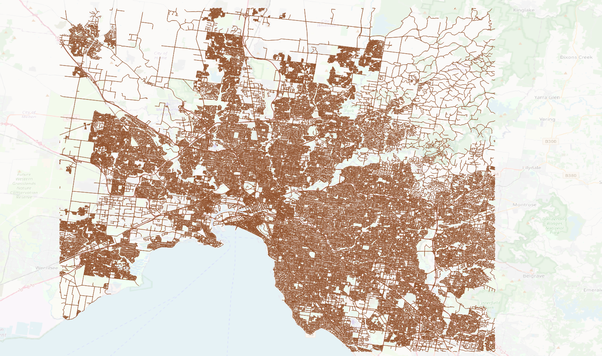

===============
Sample Networks
===============

Phoenix Sky Harbor International Airport
========================================

    Phoenix Sky Harbor International Airport

Arizona State University, Tempe Campus
========================================

    Arizona State University, Tempe Campus

Arizona, US
========================================

    Arizona, US

US railway network (midwest)
========================================

    US railway network (midwest)

Greater London, UK
========================================

    Greater London, UK

Melbourne, Australia
========================================

    Melbourne, Australia
